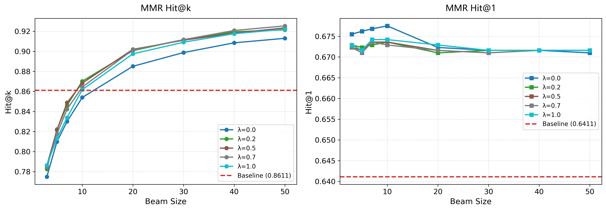
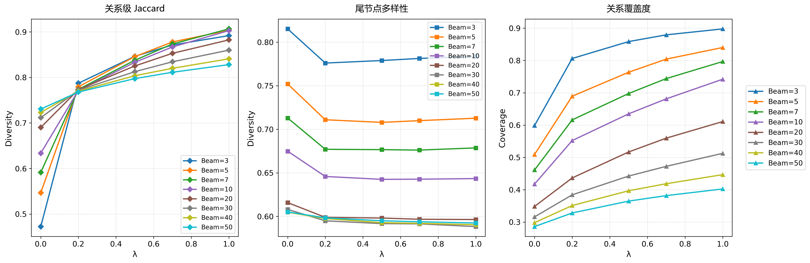
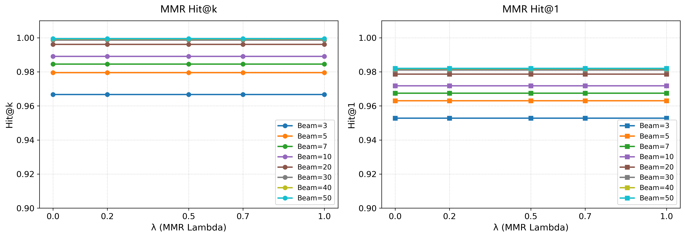

# 第三章 基于多样性波束搜索的多跳路径检索方法研究

在复杂知识图谱问答任务中，多跳路径检索（Multi-hop Path Retrieval）是实现逻辑推理的核心环节。在第二章中我们介绍了XXX。但是随着推理跳数的增加，搜索空间呈指数级增长，如何在大量的候选路径中如何高效、完整、准确的找到知识路径信息，成为了多跳路径检索任务中的关键问题。

## 3.1 多跳路径检索的问题定义

设知识图谱记为 $\mathcal{G} = (\mathcal{V}, \mathcal{R}, \mathcal{E})$，其中 $\mathcal{V}$ 为实体集合，$\mathcal{R}$ 为关系集合，$\mathcal{E} \subseteq \mathcal{V} \times \mathcal{R} \times \mathcal{V}$ 为事实三元组集合。对于给定的自然语言问题 $q$，首先通过实体链接识别其主题实体 $e_{src} \in \mathcal{V}$，多跳路径检索是在图谱 $\mathcal{G}$ 上，从主题实体 $e_{src}$ 出发，经过至多 $T$ 跳关系推理，检索答案实体 $e_{ans} \in \mathcal{V}$，并输出连接二者的证据路径集合 $\mathcal{P}$。

形式化地，一条长度为 $t$ 的路径表示为：

$$
P = [e_0, r_1, e_1, r_2, \dots, r_t, e_t]
$$

其中 $e_0 = e_{src}$，$e_t$ 为候选答案实体，且任意相邻三元组 $(e_{i-1}, r_i, e_i) \in \mathcal{E}$。与仅输出答案实体的传统方法不同，本章关注的问题可表述为：

$$
(e_{ans}, \mathcal{P}) = \arg\max_{e \in \mathcal{V},\, P \in \Pi(e_{src}, e)} p(e, P \mid q, \mathcal{G})
$$

其中 $\Pi(e_{src}, e)$ 表示从 $e_{src}$ 到 $e$ 的可行路径集合。因此，本章方法的核心任务并非单纯预测终点实体，而是在保证答案相关性的同时，尽可能召回多条互补的高质量证据路径。

## 3.2 基于 TransferNet 的基础逐跳检索机制

为了在知识图谱上执行高效的多跳路径检索，本章采用 TransferNet 作为基础逐跳检索算法。其核心思想是将多跳问答建模为实体概率分布在关系图上的多步状态转移：模型在每一跳根据问题语义生成关系权重，并计算相应的转移概率矩阵，在图上并行传播实体得分。该过程保持可微，因此能够端到端训练；同时，每一跳的关系权重与实体分布都可被显式观察，具备逐步可解释性。

### 3.2.1 问题编码与关系注意力建模

给定自然语言问题 $q$，首先使用文本编码器得到句级表示 $\mathbf{q} \in \mathbb{R}^{d}$ 以及词级隐藏状态 $\mathbf{H} = [\mathbf{h}_{1}, \ldots, \mathbf{h}_{L}]$。在第 $t$ 跳推理时，通过跳数编码器得到当前步的查询向量 $\mathbf{c}^{t} \in \mathbb{R}^{d}$：

$$
\mathbf{c}^{t} = f_{t}(\mathbf{q})
$$

其中 $f_t(\cdot)$ 表示第 $t$ 跳对应的可学习映射。随后，模型以 $\mathbf{c}^{t}$ 为查询，对问题中的词级表示进行注意力汇聚，得到该跳的上下文表示：

$$
\boldsymbol{b}_{i}^{t} =
\frac{\exp \left( (\mathbf{c}^{t})^{\top}\mathbf{h}_{i} \right)}
{\sum_{j=1}^{L} \exp \left( (\mathbf{c}^{t})^{\top}\mathbf{h}_{j} \right)},
\qquad
\mathbf{u}^{t} = \sum_{i=1}^{L} b_{i}^{t}\mathbf{h}_{i}
$$

基于该上下文表示，模型进一步预测当前跳对各关系的权重：

$$
\boldsymbol{\alpha}^{t} = g(\mathbf{u}^{t}),
\qquad
\alpha_{r}^{t} = [\boldsymbol{\alpha}^{t}]_{r}
$$

其中 $g(\cdot)$ 为关系得分计算函数。对于每个得分，TransferNet 使用 Sigmoid 函数对关系打分进行逐维映射，从而为每个关系分配独立的转移强度，而非通过 Softmax 形成归一化的单峰概率分布。因而，$\alpha_r^t$ 可以理解为第 $t$ 跳中关系 $r$ 对实体状态传播的贡献权重，而不是互斥关系选择下的概率值。

### 3.2.2 实体激活分布的图上转移

假设在第 $t-1$ 跳推理实体激活分布为 $\mathbf{s}^{t-1} \in \mathbb{R}^{|\mathcal{V}|}$。初始时刻，主题实体对应位置置为 1，其余实体置为 0：

$$
\mathbf{s}^{0}[e] =
\begin{cases}
1, & e = e_{src} \\
0, & \text{otherwise}
\end{cases}
$$

对于关系 $r$ 的稀疏邻接矩阵为 $\mathbf{M}_{r} \in \{0,1\}^{|\mathcal{V}| \times |\mathcal{V}|}$，当前跳的整体转移算子可写为：

$$
\mathbf{M}^{t} = \sum_{r \in \mathcal{R}} \alpha_{r}^{t} \mathbf{M}_{r}
$$

于是实体状态更新可表示为：

$$
\mathbf{s}^{t} = (\mathbf{M}^{t})^{\top}\mathbf{s}^{t-1}
= \sum_{r \in \mathcal{R}} \alpha_{r}^{t} \cdot \mathbf{M}_{r}^{\top}\mathbf{s}^{t-1}.
$$


### 3.2.3 从实体分布到显式路径的转化需求

逐跳转移机制能够有效计算与问题高相关性的实体，并通过每一跳的关系权重与实体分布提供一定程度的过程可解释性。然而，其直接输出仍是连续的节点级得分，而非离散、可枚举的显式推理路径。这一差异带来两个问题：
1. 虽然可以观察“哪些关系更重要、哪些实体被激活”，但模型并不会直接给出一条完整的实体-关系-实体推理路径，因而不便于进行 Top-K 路径排序与对比，可解释性较差；
2. 在与大语言模型结合时，仅提供答案实体或局部高分边，往往不足以构成结构完整、可序列化的证据上下文，难以稳定支撑模型的语义推理。因此，需要在逐跳转移的基础上进一步设计显式路径提取算法，将连续的图激活过程还原为可排序、可比较、可序列化的候选路径集合。

## 3.3 基于 MMR 的多样性多束路径检索算法

为解决常规波束搜索（Beam Search）在图空间中易产生的同源路径问题，本章在显式路径构造阶段引入 MMR 多样性重排序机制。其核心思想是：在保留路径相关性的同时，对与已选路径过于相似的候选施加惩罚，以提高 Top-K 路径之间的互补性。我们利用 TransferNet 逐跳关系分数与实体分数恢复候选路径，再在固定波束宽度下执行 MMR 贪心筛选。

图 3-1 基于 MMR 的多样性多束路径检索完整流程

### 3.3.1 候选路径构造与原始得分

在第 $t$ 跳，对于上一跳保留的路径前缀 $P^{t-1} = [e_0, r_1, e_1, \dots, e_{t-1}]$ 和尾实体 $u = e_{t-1}$，我们首先获取从 $u$ 出发的所有有效出边，并根据第 $t$ 跳的关系得分和实体得分进行筛选，只有当关系 $r$ 与目标实体 $v$ 均处于激活集合时才保留该候选路径：

$$
P^{t} = [e_0, r_1, e_1, \dots, r_t, e_t]
$$

由于 TransferNet 输出的关系分数是全局的转移权重，而非严格意义上的局部条件概率，无法直接反映当前节点上各候选边的相对优先级，因此需要对关系分数进行局部归一化。具体地，定义实体 $u$ 在第 $t$ 跳的可达激活关系集合为：

$$
\mathcal{R}_{t}(u)=\{r \mid \exists v,\ (u,r,v)\in \mathcal{G},\ \alpha_r^t \ge \tau_r\}
$$

对任一候选边 $(u,r,v)$，其关系局部归一化得分定义为：

$$
\tilde{\alpha}_{r}^{\,t}(u)=
\frac{\alpha_r^t}
{\sum_{r' \in \mathcal{R}_{t}(u)} \alpha_{r'}^t + \varepsilon}
$$

对于实体分数，我们采用全局归一化而非关系内归一化。这是因为关系内归一化会对高扇出关系产生系统性惩罚：当某一关系连接的目标实体数量远多于其他关系时，每个目标实体被均摊的概率极低，导致该关系的路径得分被严重压低，即使该关系在语义上更符合问题意图。为消除这一偏差，定义第 $t$ 跳的全局激活实体集合为：

$$
\mathcal{V}_{t}=\{v \mid \mathbf{s}^{t}[v] \ge \tau_e\}
$$

其中 $\mathbf{s}^{t}[v]$ 为向量 $\mathbf{s}^{t}$ 中实体 $v$ 对应的分量。那么实体全局归一化得分则可以定义为：

$$
\tilde{\beta}^{\,t}(v)=
\frac{\mathbf{s}^{t}[v]}
{\sum_{v' \in \mathcal{V}_{t}} \mathbf{s}^{t}[v'] + \varepsilon}
$$

其中 $\tau_r,\tau_e$ 为推理阶段的激活阈值，$\varepsilon = 10^{-8}$ 为数值平滑项，用于防止分母为零。上述可得单步路径得分为：

$$
\text{score}_{\text{step}}(u, r, v; t) = \log \left( \tilde{\alpha}_{r}^{t}(u) \right) + \log \left( \tilde{\beta}^{t}(v) \right)
$$

考虑到不同跳数的路径在最终阶段需统一排序，使用长度归一化得分以消除路径长度对累计对数得分量级的影响，长度为 $t$ 的路径最终得分为：

$$
S_{raw}(P^{t})= \frac{1}{t} \sum_{i=1}^{t} \text{score}_{\text{step}}(e_{i-1}, r_i, e_i; i)
$$

### 3.3.2 路径相似度度量

在知识图谱推理中，通常是以边级三元组 $(e_{i-1}, r_i, e_i)$ 作为路径表示，但如果以边级三元组的相似性度量，那么经由同一关系但到达不同尾实体的路径将被视为完全不相似，从而使得波束集合内可能存在大量同一关系的多条路径，这会导致多样性不足，无法检索到更多样有价值的路径。

基于上述考虑，我们以**关系序列**而非边序列作为路径的相似度表示。对于路径 $P = [e_0, r_1, e_1, \dots, r_t, e_t]$，定义其带位置编号的关系集合为：

$$
\mathcal{F}_{P} = \{(i,\, r_i) \mid i = 1, 2, \dots, t\}
$$

两条路径 $P_i$ 与 $P_j$ 的相似度定义为带位置关系集合上的 Jaccard 相似度：

$$
\operatorname{Sim}(P_i, P_j) =
\frac{|\mathcal{F}_{P_i} \cap \mathcal{F}_{P_j}|}
{|\mathcal{F}_{P_i} \cup \mathcal{F}_{P_j}|}
$$

该定义使得经过相同关系序列的路径（无论尾节点是否不同）被视为高度相似，在 MMR 剪枝中受到有效抑制，从而促使最终 beam 覆盖更多不同关系类型的推理路径，提升路径集合的语义多样性。

### 3.3.3 基于 MMR 的波束剪枝策略

设第 $t$ 跳候选路径集合为 $\mathcal{C}^{t}$，目标是以贪心方式从中依次选出 $B$ 条路径，构成新的波束集合 $\mathcal{B}^{t}$。记选择过程的中间状态为 $\mathcal{B}^{t,m-1}$（已选前 $m-1$ 条），初始时 $\mathcal{B}^{t,0} = \emptyset$，选满后 $\mathcal{B}^{t} \triangleq \mathcal{B}^{t,B}$。我们借鉴了信息检索领域的最大边际相关性（MMR，Carbonell & Goldstein, 1998）算法，其核心思想是在每步选择中同时考虑候选与查询的相关性以及与已选集合的差异性：

$$
\text{MMR} \triangleq \arg\max_{d_i \in R \setminus S} \left[ (1-\lambda)\,\operatorname{Sim}(d_i, Q) - \lambda \max_{d_j \in S} \operatorname{Sim}(d_i, d_j) \right]
$$

然而，直接将原始 MMR 应用于路径波束剪枝存在两个问题。**第一，相关性与多样性强耦合。** 原始公式用 $(1-\lambda)$ 对相关性项加权，使得调大多样性惩罚 $\lambda$ 的同时必然压缩相关性得分：当 $\lambda$ 较大时，所有路径的相关性权重趋近于零，模型失去区分不同路径的能力，排序退化为纯多样性驱动。**第二，惩罚量级与路径得分不对齐。** 原始公式中两项均为相似度分数，值域为 $[0, 1]$，量级天然匹配；但我们需要选择的路径得分 $S_{raw}$ 由对数概率累加而得，值域为 $(-\infty, 0)$，与相似度项相差悬殊。固定量级的惩罚 $\lambda \cdot \max \operatorname{Sim} \in [0, \lambda]$ 在路径得分差异较大时几乎不起作用，在路径得分差异极小时又会主导排序，无法在两种情形下均保持稳定的多样性约束强度。

针对上述问题，本节对 MMR 公式进行两处改进，提出适用于路径波束剪枝的打分函数。当已选部分波束为 $\mathcal{B}^{t,m-1}$，准备选择第 $m$ 条路径时，对候选路径 $P_c \in \mathcal{C}^{t} \setminus \mathcal{B}^{t,m-1}$ 计算：

$$
S_{MMR}(P_c \mid \mathcal{B}^{t,m-1}) =
S_{raw}(P_c) - \lambda \cdot
\max_{P_b \in \mathcal{B}^{t,m-1}} \operatorname{Sim}(P_c, P_b) \cdot |S_{raw}(P_c)|
$$

其中 $\lambda \in [0,1]$ 为多样性惩罚权重。基于公式我们做出了两点相应的改进，首先，我们去掉相关性项上的 $(1-\lambda)$ 系数，令 $S_{raw}$ 直接参与排序，使得调整 $\lambda$ 只影响惩罚幅度而不破坏路径间的相关性排序。其次，令惩罚项乘以 $|S_{raw}(P_c)|$，将多样性惩罚的量级与路径自身得分绑定，确保无论 $S_{raw}$ 取值范围如何，相似度相同的候选均受到等比例的抑制。当 $\mathcal{B}^{t,m-1}$ 为空时，最大相似度定义为 0，首条路径退化为纯得分选择；当 $\lambda = 0$ 时等价于标准波束搜索；$\lambda$ 越接近 1，多样性惩罚越强。

进一步分析改进后公式在对数得分域下的行为：由于 $S_{raw}(P_c) < 0$，有 $|S_{raw}(P_c)| = -S_{raw}(P_c)$，惩罚项实际为 $-\lambda \cdot \max \operatorname{Sim} \cdot S_{raw}(P_c)$，这意味着本身得分越高的路径受到的绝对惩罚幅度越小，在多样性约束下仍可优先保留；而得分较低的冗余候选则受到更强抑制，从而在整体上实现**高质量优先、冗余过滤**的效果。

同时考虑到路径检索的性能，我们记每跳平均扩展分支数为 $d$，波束宽度为 $B$，最大跳数为 $T$，则候选生成的时间复杂度约为 $O(TBd)$。每一跳最多形成 $O(Bd)$ 个候选路径，而贪心 MMR 需要从中迭代选出最多 $B$ 条，因此重排序开销约为 $O(TB^2d)$。由于实际大部分的图谱问答中 $T$ 很小，且波束宽度 $B$ 远小于图谱规模，因此我们的方法能在检索效率与路径覆盖之间取得较好的平衡。

## 3.4 基于多跳路径增强的大语言模型推理研究

上一节提出的多束路径检索算法能够高效检索出有价值的知识路径，但对于最终端到端的问答任务依旧存在两个问题，一方面是检索出的路径并不是最终答案，其正确性仅能够简单的使用路径的尾实体进行判断，另一方面则是检索出来的路径信息包含着部分冗余的、无效的信息，需要一个模块根据检索的路径信息进行推理。考虑到目前大语言模型已经具备优秀的推理能力，我们将检索到的多束路径信息作为上下文证据传递给大模型进行进一步的推理。为此，本章采用"多束路径序列化 + 零样本推理验证"的方式实现一个完整的推理链路，并证明多束路径检索算法的有效性。

### 3.4.1 路径信息的序列化策略

在知识图谱问答的上下文构建阶段，我们并未将检索到的图谱子图转化为通用的自然语言描述，而是采用结构化链式路径（Structured Chained Paths）作为大型语言模型的输入。虽然自然语言转换后会更符合大模型的预训练语料形态，但会带来更多的句法噪音与停用词，从而导致大模型的“注意力稀释（Attention Dilution）”问题。基于近期大量研究的共识，我们对图谱路径进行线性化处理，保留了原始的 [头实体] -> [关系] -> [尾实体] 拓扑关系。这种高信息密度的结构化输入不仅大幅降低了大模型推理输入的消耗，更重要的是，它能作为明确的逻辑锚点（Logical Anchors），有效激发 LLM 内在的思维链推理能力，从而显著降低多跳推理过程中的幻觉现象。

对于每条检索路径 $P = [e_0, r_1, e_1, \dots, r_t, e_t]$，我们保留三元组链式结构，将每一步统一序列化为 $(e_{i-1}) \rightarrow [r_i] \rightarrow (e_i)$，并将整条路径组织为有序三元组序列。同时考虑到每条路径具备不同的价值，我们保留在序列化路径时保留最终的得分，第 $k$ 条路径被写成：
$$
\texttt{Path }k\ [\texttt{score}=S_{raw}(P_k)]: (e_0)\ - [r_1] ->\ (e_1)\ \cdots\ -[r_t]->\ (e_t)
$$

### 3.4.2 基于多束路径提示的零样本推理

在完成路径序列化后，本节将多束路径证据注入大语言模型，采用零样本提示（Zero-shot Prompting）完成最终的问答推理。当 MMR 算法提供结构多样、语义互补的路径集合时，LLM 无需额外监督信号即可依托路径作为逻辑锚点定位正确答案；反之，若波束内路径高度同质，LLM 将在重复信息中无法区分答案，表现显著下降。基于这一主张，我们刻意保持推理模块的简洁性，以排除提示工程对实验结论的干扰，将方法的增益完整归因于检索侧。

完整的提示模板分为系统提示（System Prompt）与用户消息（User Message）两部分。系统提示固定如下：

```txt
You are a knowledge graph question answering assistant.
You will be given reasoning paths retrieved from a knowledge graph and a question.
Each path is a sequence of triples: (subject) --[relation]--> (object).
Answer the question by selecting the answer entity identifiers EXACTLY as they
appear in the paths. Do NOT paraphrase or translate the identifiers.
Output your answer strictly in the format:
Answer: id1 | id2 | ...
List only the answer entity identifiers (copy them verbatim from the paths)
separated by ' | '.
If the paths do not contain enough information, output the most relevant
identifier from the paths.
```

用户消息的格式如下：

```txt
Reasoning Paths:
{serialized_paths}

Question: {question}
```

其中 `{serialized_paths}` 为 3.4.1 节所述的路径序列，按 $S_{raw}$ 降序排列，共注入 Top-$K$ 条（$K = B$，与波束宽度一致）；`{question}` 为原始自然语言问题。

在系统提示词中我们做了 **verbatim ID 约束**，在数据集中 Freebase 实体标识符为不透明的机器编码（如 `m.02mjmr`），在初期实验中我们发现大模型倾向于将其翻译为自然语言名称（如 `Barack Obama`），导致答案提取时与答案表现的 ID 无法对齐，造成大量误判损失，而我们尝试将所有 ID 转换为自然语言时却发现依旧存在大量 ID 无法获取映射关系，于是我们在提示词中约束大模型输出原路径中的 ID，从而降低其主动翻译的幻觉。

同时我们有意回避 few-shot 示例与 COT 等提示增强手段，主要原因是本节的核心是在验证多束路径检索算法，推理模块应尽可能保持本身能力而不使用过多技巧，以此确保实验结果能干净地反映路径质量对答案准确率的影响；此外，高质量的结构化路径本身能够作为显式推理链，无需额外引导大模型生成中间推理步骤。

在提示词中我们还约束了输出格式，答案提取策略如下：截取 `Answer:` 标记后的第一行文本，按 `|` 分割并去除首尾空白字符，得到预测答案集合 $\hat{\mathcal{A}}$。整个提取过程不依赖任何额外模型，计算开销可忽略不计。

图 3-2 展示了检索模块与推理模块的完整数据流：TransferNet 的逐跳关系权重与实体得分经 MMR 剪枝后，输出 Top-$K$ 条显式路径；路径经序列化后拼接至提示模板，送入 Llama-3.1-8B 推理，最终提取答案实体集合 $\hat{\mathcal{A}}$。两个模块之间仅通过序列化文本交互，无需联合训练，具备良好的模块替换性与可扩展性。

## 3.5 实验设计与结果分析

### 3.5.1 数据集与实验设置

本章选取 WebQSP 和 MetaQA 知识图谱问答作为评测数据集。两者在领域特征、图谱规模、问题复杂度以及答案分布上存在显著差异，能够从封闭域与开放域、简单推理与复杂推理、小规模与大规模知识图谱多个维度全面检验所提方法的有效性与普适性。

1. WebQSP（Web Questions Semantic Parses）
WebQSP 是基于 Freebase 知识图谱构建的开放域问答基准，由 Yih 等人在 WebQuestions 数据集基础上扩展语义解析标注而来。其知识来源 Freebase 是一个覆盖人物、地点、组织、作品等广泛领域的通用知识图谱，包含约 578 万条三元组，涵盖实体别名、关系类型均十分丰富。在问题特征上主要考察 1 跳和 2 跳关系推理，部分题目涉及约束条件过滤，推理链相对灵活，训练集 3097 条，测试集共 1639 条。在答案特征上，WebQSP 存在较多多选答案，答案实体以 Freebase 机器标识符（MID）形式表示，对模型的实体精确识别能力要求较高。由于图谱规模大、关系类型多样，路径搜索空间广，是检验路径多样性检索方法的典型场景。

1. MetaQA（MoviE Text Audio QA）
MetaQA 数据集由 Zhang 等人提出，基于 WikiMovies 电影领域知识图谱构建，涵盖导演、演员、类型、年份等九类关系。对应的知识图谱规模适中，实体与关系覆盖相对封闭，图谱结构较为规整。在问题特征上较为问答数据集主要考察 1 至 3 跳，数据量较大，训练集共 329282 条样本，测试集 39093 条。

### 数据集对比

| 属性        |       WebQSP       |        MetaQA        |
| :---------- | :----------------: | :------------------: |
| 领域        | 开放域（Freebase） | 封闭域（WikiMovies） |
| 问题类型    |   1–2 跳关系推理   |    1–3 跳关系推理    |
| KG 三元组数 |     约 578 万      |        134741        |
| 训练集大小  |        3097        |        329282        |
| 测试集大小  |        1639        |        39093         |
| 多答案题目  |        较多        |         较少         |

---

### 3.5.2. 评价指标

为全面评价路径检索质量，本章定义两类指标：**答案检索质量指标**和**路径多样性指标**。前者衡量检索结果是否覆盖正确答案及其精确程度，后者衡量 Top-$K$ 路径之间的结构互补性。

设 Top-$K$ 条路径的尾实体集合为 $\mathcal{A}_K$，真实答案集合为 $\mathcal{A}^*$，路径集合为 $\{P_1, \ldots, P_K\}$，每条路径表示为节点-关系交替序列 $P = [e_0, r_1, e_1, \ldots, r_t, e_t]$，其对应边三元组集合记为 $\mathcal{T}(P) = \{(e_{i-1}, r_i, e_i)\}_{i=1}^{t}$。

#### 答案检索质量指标

**答案路径命中率**：设 Top-$K$ 路径的尾实体集合为 $\mathcal{A}_K = \{e_t^{(k)}\}_{k=1}^{K}$，若其与真实答案集合有交集，则该样本记为命中：

$$
\text{Hit@}K = \frac{1}{N}\sum_{i=1}^{N} \mathbf{1}\left[\mathcal{A}_K^{(i)} \cap \mathcal{A}^{*(i)} \neq \varnothing\right]
$$

该指标关注"至少有一条路径终点正确"，是衡量路径检索召回能力的主要指标，反映了 $K$ 条路径联合覆盖答案的上界能力。

**首条路径命中率**：仅考察 MMR 排序第一条路径的尾实体是否命中正确答案：

$$
\text{Hit@}1 = \frac{1}{N}\sum_{i=1}^{N}\mathbf{1}\left[e_t^{(1,i)} \in \mathcal{A}^{*(i)}\right]
$$

该指标类似检索系统的 Precision@1，反映 MMR 排序后最高置信路径的质量，可用于验证 MMR 排序机制对首位路径质量的干扰程度。

#### 路径多样性指标

三项多样性指标分别从关系级结构差异、尾节点分散度和关系模式覆盖三个角度衡量 $K$ 条路径之间的多样性。指标值域均为 $[0, 1]$，值越大表示多样性越强。

**关系级 Jaccard 多样性**：对所有 $\binom{K}{2}$ 个路径对，计算关系集合上的 Jaccard 相似度后取补，再求均值：

$$
\text{Rel-Jaccard-Div@}K = 1 - \frac{2}{K(K-1)}\sum_{1 \le i < j \le K} \frac{|\mathcal{F}_{P_i} \cap \mathcal{F}_{P_j}|}{|\mathcal{F}_{P_i} \cup \mathcal{F}_{P_j}|}
$$

其中 $\mathcal{F}_{P}$ 是路径 $P$ 上的带位置关系集合。该指标衡量路径对之间关系级的平均差异度，值越高说明最终检索的路径在每一跳上使用的关系越不重复。

**尾节点多样性**：衡量 $K$ 条路径终点实体的多元程度：

$$
\text{Tail-Div@}K = \frac{\left|\left\{e_t^{(k)} : k = 1,\ldots,K\right\}\right|}{K}
$$

该指标值域为 $[1/K, 1]$，越高说明 $K$ 条路径指向越多不同的候选答案实体，直接影响 Hit@$K$ 和 Recall 的上界。当所有路径均指向同一尾节点时，Tail-Div@$K$ = $1/K$；当各路径终点互不相同时，Tail-Div@$K$ = 1。

**关系覆盖率**：衡量 $K$ 条路径在关系模式层面的覆盖广度：

$$
\text{Rel-Cov@}K = \frac{\left|\bigcup_{k=1}^{K}\mathcal{F}_{P_k}\right|}{\sum_{k=1}^{K}|\mathcal{F}_{P_k}|}
$$

分子为 $K$ 条路径的去重关系总数，分母为各路径关系数之和。该值越高，说明路径之间重复使用相同关系模式的比例越低，最终保留的路径集合覆盖了更多不同的推理关系组合。当任意两条路径在每一跳上均不共享关系时，Rel-Cov@$K$ = 1；当所有路径的关系序列完全相同时，Rel-Cov@$K$ = $1/K$。

三项多样性指标从不同粒度刻画路径集合的互补性：Rel-Jaccard-Div@$K$ 从关系级结构视角衡量路径对之间的差异性，直接对应 3.3.2 节中的 MMR 目标；Tail-Div@$K$ 从答案端视角衡量候选答案实体的覆盖广度，与 Hit@$K$ 和 Recall 直接相关；Rel-Cov@$K$ 则进一步从集合覆盖角度衡量最终路径对关系的选择程度。三者结合，可以从"关系选择是否真正多样"（Rel-Jaccard-Div）、"候选答案是否足够多元"（Tail-Div）和"关系模式是否足够丰富"（Rel-Cov）三个维度对 MMR 机制的多样性增益进行定量验证。

### 3.5.3 多束路径检索效果与消融分析

#### MMR 效果分析



从检索质量上来看，随着波束宽度越来越大，答案的命中率越来越高，在基础模型 TransferNet 上，hits@1 指标仅有 0.64，而我们的多束检索能够达到 0.67，提升了 3 个百分点，更重要的是，原本 TransferNet 在 hits 上仅有 0.86，而在多样性波束检索算法下，在波束宽度 k=20 时就达到了 0.90 以上。

此外，当 $\lambda$ = 0 时，我们的路径检索算法退化为没有多样性约束的多束检索方法，可以清楚的看到，缺少多样性约束的多束检索方法，在 Hits 上与我们的算法相差了接近 2 个百分点，而在 hits@1 指标上，当波束宽度增加到 20 后也与我们的算法几乎一致。这些指标充分证明了我们提出的路径检索算法能够准确、有效的检索到更多高价值的路径。



从多样性指标来看，随着多样性约束 $\lambda$ 的增长，关系级 Jaccard 多样性逐渐增长，这直接表明 MMR 确实在其优化目标上有效拉开了最终路径集合的关系模式差异。关系覆盖度整体也随 $\lambda$ 增长而上升，且在较小波束宽度下更加明显，说明关系级 MMR 更倾向于保留关系模式不同的候选路径。与此同时，尾节点多样性会随 $\lambda$ 增大而略有下降，这说明路径结构虽然更加分散，但终点实体反而会出现一定程度的收敛。结合前述 Hit@$K$ 的结果可以看出，我们的方法并非机械地追求路径彼此不同，而是在保持答案相关性的前提下尽可能引入互补的推理路径。

结合路径检索质量和多样性指标可以看出，随着波束宽度 $K$ 的增长，Hit@$K$ 持续提高，但多样性收益在 $K \approx 20$ 后逐渐趋于平缓，更大的波束主要引入置信度较低且模式重复的候选路径。因此，从检索收益与后续 LLM 输入长度的平衡来看，$K=20$ 左右已经能够覆盖大部分有效路径。在多样性约束方面，$\lambda$ 取 0.2 - 0.5 时通常能够在答案命中率与关系模式多样性之间取得更稳定的折中，因此本文后续实验采用波束宽度 $K=20$、多样性约束 $\lambda=0.2$ 作为默认设置。

#### MetaQA 多样性“失效”分析

在对 MetaQA 数据集进行实验时，我们观察到了多样性惩罚“失效”的现象，如图 metaqa指标“失效”分析 所示，随着 $\lambda$ 变化，所有指标几乎是一条水平的直线，深入剖析算法的底层执行逻辑，我们发现这并非算法失效，而是由于 MetaQA 图谱关系类型极少，结合 TransferNet 模型推理时的高置信度激活，导致在阈值剪枝后，实际可扩展的候选路径数量 $|C|$ 往往小于或等于波束宽度 $B$。根据本章 3.3.3 节的 MMR 剪枝策略，当候选集规模小于波束时，多样性惩罚项仅能改变候选路径的内部排序，而无法改变最终进入波束的路径集合，从而最终表现为基于集合评估的覆盖率、命中率等宏观指标保持稳定。对于 Hit@1 而言，由于每跳第一次选择时已选集合为空（无多样性惩罚），第一条路径始终退化为 $S_{raw}$ 最优选择，因此在候选数 $|C| \leq B$ 时 Hit@1 同样与 $\lambda$ 无关，这与实验观测完全吻合。



这一现象从反面印证了本章方法的适用边界，基于 MMR 的多样化波束搜索，其核心价值在于解决**多关系、强噪声、大搜索空间** 下的路径爆炸与同源冗余问题；而在极度稀疏或高度确定性的简单图谱场景中，算法会自动退化为全量保留的安全策略。但从结果上来看 Hit@K 和 Hit@1 指标都几乎接近 1.0，这说明我们的多束搜索策略依旧是能够有效检索出有效路径，只是在简单知识图谱上价值有限。
