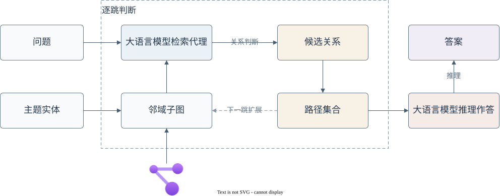
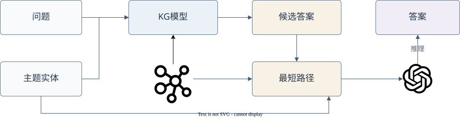
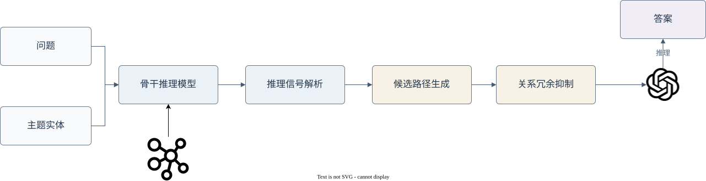
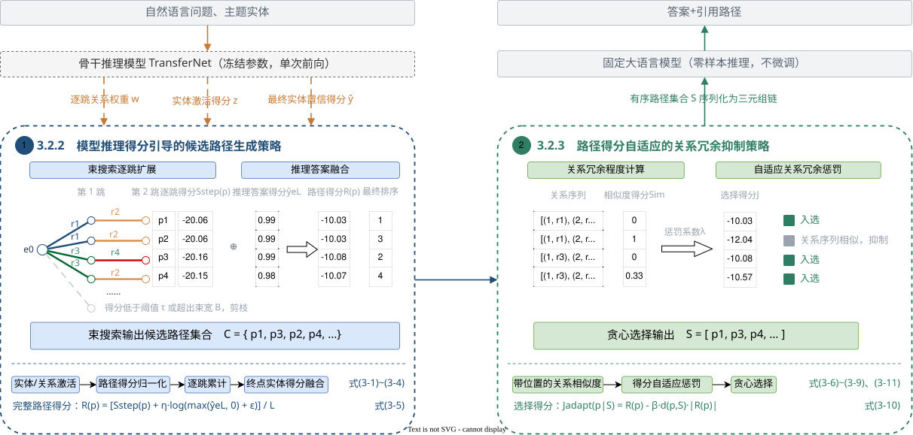
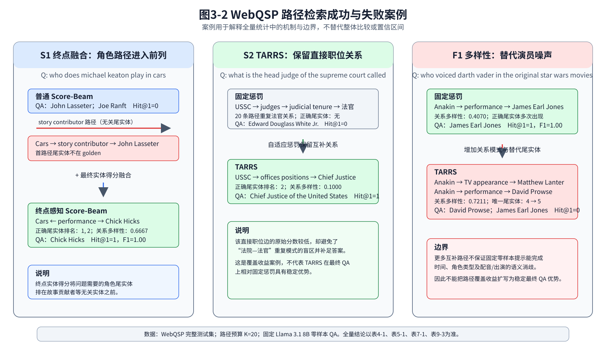

# 第三章 基于模型推理得分引导的多样化路径检索方法

## 3.1 引言

大语言模型（LLMs）通过在海量语料上进行预训练，获得了强大的自然语言理解与推理能力，并在多种自然语言处理任务中取得了显著的成功。然而，在需要严格事实依据的忠实推理问答任务中，大模型依然面临着严峻的挑战。一方面，模型难以仅凭内部的参数化知识忠实地回答问题，容易出现“幻觉”（Hallucination）或生成过时的信息；另一方面，其推理结果缺乏明确的证据支撑，难以给出可追溯、可解释的事实证据。知识图谱（KGs）通过实体和关系的形式存储客观世界中的结构化事实，能够为推理问答任务提供可靠的外部知识来源。然而，现实中的知识图谱往往规模极其庞大、拓扑结构复杂且包含大量冗余信息，现有方法难以高效、精准地从知识图谱中检索出既符合问题深层语义，又能有效指向候选答案的显式知识路径。

近期研究开始关注如何从知识图谱中检索与问题相关的知识路径，并将其作为大语言模型的上下文来提高推理问答性能。一类方法由大语言模型直接完成路径规划。以ToG[4]为例，其流程如图3-1所示：根据问题和主题实体在知识图谱上迭代检索实体和关系，并使用大语言模型进行判断和推理。与ToG的逐跳交互式搜索不同，RoG[3]通过微调大语言模型直接生成与问题语义相关的关系路径规划，再依据关系序列在知识图谱中检索可执行路径。这两类方法利用大语言模型的语义理解能力指导路径规划，但前者需要在检索过程中多次调用大语言模型，后者则需要针对路径规划任务进行专门微调，引入额外的训练或推理成本。



<p align="center">图3-1　ToG方法的流程图</p>

另一类方法复用已有知识图谱问答模型进行图检索。以GNN-RAG[2]为例，其流程如图3-2所示，该方法使用图神经网络在稠密问题子图上推理并预测候选答案节点，再提取主题实体与候选答案之间的最短路径，将路径文本化后提供给大语言模型进行问答。该方法生成的显式路径主要由候选终点与主题实体之间的最短连通结构决定，并未考虑模型逐跳推理时对关系和中间实体的相关性。



<p align="center">图3-2　GNN-RAG方法的流程图</p>

针对上述问题，本章提出一种基于模型推理得分引导的多样化路径检索方法（Reasoning-Score-guided Diversified Path Retrieval，RSDPR），流程如图3-3所示。该方法以知识图谱推理模型作为骨干推理模型（Backbone），将其单次前向推理产生的内部信号作为路径检索的依据，逐跳生成显式候选路径，并使用关系冗余抑制相似路径，最终选取 Top-K 路径作为大语言模型问答推理的上下文知识。



<p align="center">图3-3　本章所提RSDPR方法的流程图</p>

具体而言，本章的主要工作包括两个方面：一是提出模型推理得分引导的候选路径生成策略，充分利用现有知识图谱推理模型作为骨干模型，使显式路径的检索依据与骨干推理模型自身的推理过程保持一致，无需为路径规划引入额外的训练或推理开销；二是考虑到受骨干模型自身推理能力限制，其赋予较高得分的关系序列未必对应正确的推理方向，若仅依据路径得分检索最终路径，重复的高分错误路径会占用有限的路径预算。为此，提出路径得分自适应的关系冗余抑制策略，抑制重复关系序列的出现，为得分较低但可能正确的关系路径保留入选机会。在WebQSP数据集的实验中，本章方法在端到端问答上取得90.01%的Hit和82.23%的Hit@1，相较无知识图谱路径增强的大语言模型推理，Hit和Hit@1分别提高41.12和57.18个百分点，这充分说明显式知识路径显著增强了大语言模型的推理问答能力；此外相比于骨干推理模型Hit@1提高了10.83个百分点，相比于先进的RoG、GNN-RAG方法，Hit和Hit@1分别提升了4.31和1.63个百分点，说明本章所提基于模型推理得分引导的多样化路径检索方法的有效性。

## 3.2 模型推理得分引导的多样化路径检索方法

本节详细介绍所提出的方法，首先概述所提出方法的整体框架，然后介绍设计的路径检索方法的具体策略，包括模型推理得分引导的候选路径生成策略和路径得分自适应的关系冗余抑制策略，最后给出检索算法流程和复杂度分析。

### 3.2.1 方法整体框架

图3-4展示了本章所提方法的整体框架，基于骨干模型推理信号（图3-4（a，b）），应用模型推理得分引导的候选路径生成策略（图3-4（c））和路径得分自适应的关系冗余抑制策略（图3-4（d））。



<p align="center">图3-4　基于模型推理得分引导的多样化路径检索整体框架</p>

本章以TransferNet[1]知识图谱推理模型作为我们的骨干模型，该模型输入自然语言问题 $q$、主题实体 $\mathcal{e}_0$ 在 $\mathcal{G}_q$ 上执行多跳推理（图3-4（a））。在逐跳推理过程中可解析出关系权重 $\mathbf{w}^{(h)}$与实体激活得分 $\mathbf{z}^{(h)}$，并可获得最终预测实体置信得分 $\hat{\mathbf{y}}$。得分预处理阶段以这三类得分为依据，在每个推理步骤内激活满足激活阈值的关系与实体，并进行得分归一化（图3-4（b））。

在候选路径生成阶段，以当前实体为检索起点，联合关系权重与实体激活得分计算当前步路径转移得分，并融合最终实体置信得分形成完整路径评分。随后通过束搜索限制中间候选规模，将不同跳数生成的路径经统一评分后合并为候选路径池 $\mathcal{C}$（图3-4（c））。

在关系冗余抑制阶段，根据候选路径的相关性得分以及候选路径与已选路径之间的关系相似度进行贪心筛选，在固定路径预算内选出结构互补的Top-$K$路径，得到显式有序路径集合 $\mathcal{S}$（图3-4（d））。

以问题"what tv shows did shawnee smith play in"为例说明本章方法的应用逻辑。在得分预处理阶段，主题实体的95条出边中，出生地、父母、配偶等与问题语义无关的关系得分低于阈值而被滤除，保留89条有效边参与后续扩展。在候选路径生成阶段，第二跳的951015条可扩展边经激活筛选降至803条，再由束搜索宽度限制截断至200条，与一跳结果合并后得到249条候选路径。在关系冗余抑制阶段，若仅按路径得分选取前$K$条，20条入选路径具有完全相同的关系序列；引入路径得分自适应的冗余抑制后，关系序列增至8种，其中命中答案的路径由1条增至5条、覆盖的答案实体由1个增至3个。完整算法流程在3.2.4节表述。

### 3.2.2 模型推理得分引导的候选路径生成策略

记问题子图为 $\mathcal{G}_q=(\mathcal{V}_q,\mathcal{R}_q,\mathcal{E}_q)$，主题实体集合为 $\mathcal{E}_0$。骨干模型在第 $h$ 个推理步骤输出关系权重 $\mathbf{w}^{(h)}$ 和实体激活得分 $\mathbf{z}^{(h)}$，并在完成多跳推理后输出最终实体置信得分 $\hat{\mathbf{y}}$。由主题实体 $e_0$ 出发、长度为 $L$ 的路径记为 $p=(e_0,r_1,e_1,\ldots,r_L,e_L)$，其中 $1\leq L\leq H$，$(e_{h-1},r_h,e_h)\in\mathcal{E}_q$，$H$ 为最大推理跳数。

**关系—实体联合转移得分** 在选择候选转移路径的时候，使用得分阈值控制候选规模，给定得分阈值 $\tau$，第 $h$ 个推理步骤的激活关系集合和激活实体集合定义为

$$
\mathcal{A}_{R}^{(h)}=\left\{r\in\mathcal{R}_q\mid w_r^{(h)}\geq\tau\right\},\qquad
\mathcal{A}_{V}^{(h)}=\left\{e\in\mathcal{V}_q\mid z_e^{(h)}\geq\tau\right\}.
\tag{3-1}
$$

对于当前实体 $e_{h-1}$，若三元组 $(e_{h-1},r,e)\in\mathcal{E}_q$ 满足 $r\in\mathcal{A}_{R}^{(h)}$ 且 $e\in\mathcal{A}_{V}^{(h)}$，则将其作为第 $h$ 步的候选转移路径。

随后，在激活关系集合和激活实体集合内分别对关系权重和实体激活得分进行归一化：

$$
\widetilde{w}_r^{(h)}=\frac{w_r^{(h)}}{\sum\limits_{r'\in\mathcal{A}_{R}^{(h)}}w_{r'}^{(h)}},\qquad
\widetilde{z}_e^{(h)}=\frac{z_e^{(h)}}{\sum\limits_{e'\in\mathcal{A}_{V}^{(h)}}z_{e'}^{(h)}}.
\tag{3-2}
$$

归一化后的 $\widetilde{w}_r^{(h)}$ 和 $\widetilde{z}_e^{(h)}$ 表示同一推理步骤内关系与实体的相对得分，用于统一两类信号的评分尺度。

那么当前实体 $e_{h-1}$ 在第 $h$ 步候选转移路径的关系—实体联合转移得分可定义为：

$$
\ell_h(e_{h-1},r_h,e_h)
=\log\left(\widetilde{w}_{r_h}^{(h)}+\varepsilon\right)
+\log\left(\widetilde{z}_{e_h}^{(h)}+\varepsilon\right),
\tag{3-3}
$$

其中，$\varepsilon$ 为平滑项。关系项反映模型沿 $r_h$ 推理的倾向，实体项反映传播后对尾实体 $e_h$ 的置信度。那么长度为 $L$ 的路径逐跳累计得分为：

$$
S_{\mathrm{step}}(p)=\sum_{h=1}^{L}\ell_h(e_{h-1},r_h,e_h).
\tag{3-4}
$$

该累计得分代表了从主题实体出发，经过多跳关系推理到达尾实体的路径质量。

**完整路径得分** 逐跳累计得分反映了路径的关系选择与实体传播过程，但尚未考虑到骨干模型对最终答案实体的整体判断，因此考虑将路径尾实体 $e_L$ 的最终实体置信得分融入完整路径评价：

$$
R(p)=\frac{
S_{\mathrm{step}}(p)+\eta\log\left(\max\left(\hat{y}_{e_L},0\right)+\varepsilon\right)
}{L},
\tag{3-5}
$$

其中，$\eta\geq0$ 控制最终实体置信得分的影响程度，当 $\eta=0$ 时，路径得分仅由逐跳累计得分决定。此外由于式（3-3）中的对数项值域通常为非正数，多跳累加会使较长路径受到更多负分影响，通过路径长度 $L$ 进行归一化，使不同跳数的候选路径能够进行公平比较。

**束搜索候选路径生成** 为覆盖不同跳数的路径并避免枚举全部可行路径，算法逐跳执行束搜索。初始束由主题实体集合 $\mathcal{E}_0$ 中各实体对应的初始路径构成，累计得分为0。在第 $h$ 步（$1\leq h\leq L$），沿束内路径尾实体的出边转移，仅保留关系与尾实体均属于式（3-1）激活集合的三元组，依次计算单步得分、归一化并得到完整路径得分，最后将前 $B_c$ 条高分路径加入候选路径池 $\mathcal{C}$。

### 3.2.3 路径得分自适应的关系冗余抑制策略

候选路径生成后，需要从候选池 $\mathcal{C}$ 中筛选不超过 $K$ 条路径。由于路径得分 $R(p)$ 完全建立在骨干模型的推理信号之上，受限于骨干模型自身的推理能力，得分较高的路径未必对应正确的推理方向。当某一偏离真实推理方向的关系获得较高得分时，包含该关系且关系序列相同或部分相同的多条路径容易集中位于排序前列。若仅按 $R(p)$ 选取前 $K$ 条，这类结构重复的高分路径会同时进入结果集合，不仅占用有限的知识输入空间，也会使最终路径集合持续受到该高分错误关系判断的影响，导致得分略低但可能通向真实答案的路径失去入选机会。基于此，本节在优先保留高相关路径的基础上，通过关系相似度刻画路径间的关系冗余程度，并将候选路径与已选路径的关系冗余程度作为惩罚项引入选择得分。

**带位置的关系相似度** 对于路径 $p=(e_0,r_1,e_1,\ldots,r_L,e_L)$，定义带有推理位置信息的关系集合为

$$
\mathcal{F}(p)=\left\{(h,r_h)\mid h=1,2,\ldots,L\right\}.
\tag{3-6}
$$

位置索引 $h$ 用于区分同一关系出现在不同推理步骤的情况。两条路径 $p_i$ 和 $p_j$ 的关系相似度采用Jaccard系数计算：

$$
\operatorname{Sim}_{\mathrm{rel}}(p_i,p_j)
=\frac{\left|\mathcal{F}(p_i)\cap\mathcal{F}(p_j)\right|}
{\left|\mathcal{F}(p_i)\cup\mathcal{F}(p_j)\right|}.
\tag{3-7}
$$

该相似度取值为 $[0,1]$，仅依据各推理位置上的关系计算，与路径经过的具体实体无关，因而度量的是路径在关系结构上的相似程度。

**路径得分自适应的关系冗余惩罚** 设已选路径集合为 $\mathcal{S}$，对于候选路径 $p$，计算其与已选路径的最大关系相似度表示当前冗余程度：

$$
d(p,\mathcal{S})=
\begin{cases}
0, & \mathcal{S}=\varnothing,\\[4pt]
\displaystyle\max_{p'\in\mathcal{S}}\operatorname{Sim}_{\mathrm{rel}}(p,p'),
& \mathcal{S}\neq\varnothing.
\end{cases}
\tag{3-8}
$$

最大边际相关性（Maximal Marginal Relevance，MMR）[ref]是信息检索中用来权衡相关性与多样性的经典思想，通过线性加权实现相关性与冗余程度之间的权衡，从而在保持检索结果相关性的同时，尽量选择与已选结果不相似的内容。本节借鉴其权衡思想，以式（3-5）定义的路径得分 $R(p)$ 作为检索结果的相关性分数，以式（3-8）定义的冗余程度 $d(p,\mathcal{S})$ 作为相似性得分，采用固定加性惩罚直接抑制选择得分：

$$
J_{\mathrm{fix}}(p\mid\mathcal{S})
=R(p)-\beta d(p,\mathcal{S}),
\tag{3-9}
$$

其中，$\beta\geq0$ 为关系冗余系数。该形式对全部候选路径施加相同力度的惩罚，但不同问题的 $|R(p)|$ 路径得分区间不同，同一惩罚幅度相对于路径得分的比例并不一致，在得分尺度较大时抑制不足、较小时又可能过度压低候选路径的选择优先级。为使惩罚强度与得分尺度相匹配，使用候选路径得分的绝对值调整惩罚幅度，定义关系冗余自适应抑制选择得分为：

$$
J_{\mathrm{adapt}}(p\mid\mathcal{S})
=R(p)-\beta d(p,\mathcal{S})\left|R(p)\right|,
\tag{3-10}
$$

此时惩罚相对于路径得分的比例固定为 $\beta d(p,\mathcal{S})$，在不同问题的得分尺度下保持一致。由于 $R(p)$ 通常为负值，式（3-10）等价于 $R(p)\left(1+\beta d(p,\mathcal{S})\right)$，即候选路径与已选路径的关系重复程度越高，其负得分被放大得越多，选择优先级越低。当 $\beta=0$ 时，式（3-9）和式（3-10）均退化为路径得分 $R(p)$，且首条入选路径始终是相关性得分最高的路径。

**贪心路径选择** 首先初始化已选集合 $\mathcal{S}_0=\varnothing$。第 $t$ 次选择时，从剩余候选路径中选取自适应选择得分最高者：

$$
p_t^{*}=\underset{p\in\mathcal{C}\setminus\mathcal{S}_{t-1}}{\arg\max}\;
J_{\mathrm{adapt}}\left(p\mid\mathcal{S}_{t-1}\right),\qquad
\mathcal{S}_t=\mathcal{S}_{t-1}\cup\{p_t^{*}\}.
\tag{3-11}
$$

每选入一条路径后，增量更新其余候选的最大关系相似度，直至选出 $K$ 条路径或候选池为空。

### 3.2.4 算法流程与复杂度分析

本章完整流程如算法3-1所示。

**算法3-1 基于模型推理得分引导的多样化路径检索算法**

```text
输入：问题子图 Gq，主题实体集合 E0；
      逐跳关系权重 {w(h)}、逐跳实体激活得分 {z(h)}、最终实体置信得分 ŷ；
      最大推理跳数 H，得分阈值 τ，中间候选上限 Bc；
      最终路径预算 K，平滑项 ε，最终实体置信得分融合权重 η，关系冗余系数 β。
输出：有序显式路径集合 S。

1:  for h = 1, 2, ..., H do
2:      根据式（3-1）构造激活关系集合 AR(h) 和激活实体集合 AV(h)
3:      根据式（3-2）计算归一化关系得分和实体得分
4:  end for
5:  C ← ∅
6:  for L = 1, 2, ..., H do
7:      B ← {([e0], ∅, 0) | e0 ∈ E0}
8:      for h = 1, 2, ..., L do
9:          Bnext ← ∅
10:         for each 路径前缀 p ∈ B do
11:             for each 出边 (tail(p), r, e) ∈ Eq do
12:                 if r ∈ AR(h) and e ∈ AV(h) then
13:                     按式（3-3）计算联合转移得分并扩展路径 p
14:                     将扩展路径及其累计得分加入 Bnext
15:                 end if
16:             end for
17:         end for
18:         B ← Bnext 中累计得分最高的前 Bc 条路径
19:         if B = ∅ then break
20:     end for
21:     if B ≠ ∅ then
22:         按式（3-5）计算 B 中完整路径的相关性得分，并加入 C
23:     end if
24: end for
25: 对 C 按 R(p) 降序排列；S ← 空有序集合，并令所有候选的 d(p, S) ← 0
26: while |S| < K and C \ S ≠ ∅ do
27:     按式（3-10）从 C \ S 中选择得分最高的路径 p*
28:     将 p* 追加至 S
29:     for each p ∈ C \ S do
30:         d(p, S) ← max{d(p, S), Sim_rel(p, p*)}
31:     end for
32: end while
34: return S
```

其中仅当候选池中可选路径少于 $K$ 条时，最终输出数量才会少于 $K$。

设 $N_s=|\mathcal{R}_q|+|\mathcal{V}_q|$ 为每个推理步骤的得分项总数，$D$ 为束内路径尾实体的出度上限，$M=|\mathcal{C}|\leq HB_c$ 为候选路径池大小。得分筛选与归一化的代价为 $\mathcal{O}(HN_s)$；束搜索每步最多扩展 $B_cD$ 条部分路径并排序截断，对 $L=1,2,\ldots,H$ 分别执行，总代价为 $\mathcal{O}(H^2B_cD\log(B_cD))$；关系冗余抑制包含一次候选排序和至多 $K$ 轮增量选择，代价为 $\mathcal{O}(M\log M+KMH)$。因此，路径检索阶段的总体时间复杂度为

$$
T_{\mathrm{total}}
=\mathcal{O}\!\left(HN_s+H^2B_cD\log(B_cD)
+M\log M+KMH\right),
\tag{3-12}
$$

额外空间主要用于保存归一化得分、束内部分路径和候选路径池，空间复杂度为 $\mathcal{O}(HN_s+(B_cD+M)H)$。

上述复杂度不包含骨干模型的前向计算，检索仅依赖其单次推理产生的得分。

## 3.3 实验结果及分析

本节在多跳知识图谱问答的基准数据集WebQSP上进行实验。本节首先给出实验设置，然后在WebQSP数据集上将所提出的方法与先进方法进行比较，最后通过消融实验、参数敏感性实验和案例分析对所提方法进行全面的研究和分析。

### 3.3.1 实验设置

**基线模型** 本章以 TransferNet 作为骨干知识检索模型，在 WebQSP 数据集上完成训练复现，并使用不作任何微调的 Meta-Llama-3.1-8B-Instruct（4-bit 量化版本）作为基座大语言模型进行问答推理。

**评价指标** 由于WebQSP未标注唯一的标准推理路径，本章不评价检索路径与标注路径是否一致，而是从路径质量和关系多样性两方面评价检索结果。设测试集包含 $N$ 个问题，第 $i$ 个问题的真实答案实体集合为 $A_i$，检索得到的前 $K$ 条有序路径为 $P_i^K=(p_{i,1},p_{i,2},\ldots,p_{i,m_i})$，其中 $m_i\leq K$。由路径 $p$ 解析得到的候选答案实体集合记为 $\operatorname{Ans}(p)$，全部检索路径对应的候选答案实体集合为 $\widehat{A}_i^K=\bigcup_{j=1}^{m_i}\operatorname{Ans}(p_{i,j})$。

路径质量以路径答案命中率 $\operatorname{PathHit}@K$ 衡量，它考察前 $K$ 条路径解析出的候选答案中是否包含真实答案实体，定义为

$$
\operatorname{PathHit}@K=\frac{1}{N}\sum_{i=1}^{N}
\mathbb{I}\!\left(A_i\cap\widehat{A}_i^K\neq\varnothing\right),
\tag{3-13}
$$

其中，未检索到路径的问题对应的指示函数取0，当 $K=1$ 时该指标反映排在首位路径的质量。此外，以候选答案集合 $\widehat{A}_i^K$ 与真实答案集合 $A_i$ 计算每个问题的路径答案精确率和召回率并取平均，反映检索路径引入非答案实体的程度。

关系多样性以平均关系多样性 $D_{\mathrm{rel}}$ 衡量。沿用第3.2.3节定义的带跳数位置关系集合和关系相似度，第 $i$ 个问题的关系多样性等于候选路径两两关系相似度均值的补数，数据集上的平均关系多样性定义为

$$
D_{\mathrm{rel}}=\frac{1}{N}\sum_{i=1}^{N}d_i,\qquad
d_i=\begin{cases}
1-\dfrac{2}{m_i(m_i-1)}\displaystyle\sum_{1\leq a<b\leq m_i}
\operatorname{Sim}_{\mathrm{rel}}(p_{i,a},p_{i,b}),&m_i\geq2,\\[6pt]
0,&m_i<2.
\end{cases}
\tag{3-14}
$$

$D_{\mathrm{rel}}$ 的取值范围为 $[0,1]$，数值越大表示不同路径使用的带位置信息关系模式越不相似。类似的使用尾实体多样性 $D_{\mathrm{tail}}$ 作为辅助指标，其定义为检索路径的终点实体去重后的数量与路径条数之比，反映路径在答案侧的分散程度。

此外，下游问答效果采用标准的Hit@1和Hit两个口径评价。设第 $i$ 个问题的真实答案实体集合为 $A_i$，模型输出经小写转换和首尾空格清理后解析得到的预测实体序列为 $\widetilde{A}_i=(\tilde{a}_{i,1},\tilde{a}_{i,2},\ldots)$，则

$$
\operatorname{Hit}@1=\frac{1}{N}\sum_{i=1}^{N}\mathbb{I}\!\left(\tilde{a}_{i,1}\in A_i\right),\qquad
\operatorname{Hit}=\frac{1}{N}\sum_{i=1}^{N}\mathbb{I}\!\left(A_i\cap\widetilde{A}_i\neq\varnothing\right).
\tag{3-15}
$$

**实现细节** 本文方法的主要参数如表3-1所示，其中得分筛选阈值 $\tau$ 由关系与实体共用。

<p align="center">表3-1　本文方法的主要参数</p>


| 参数             | 符号    | 设置值 |
| ---------------- | ------- | -----: |
| 最大推理跳数     | $H$     |      2 |
| 最终路径规模     | $K$     |     20 |
| 中间候选上限     | $B_c$   |    200 |
| 得分筛选阈值     | $\tau$  |   0.01 |
| 关系冗余系数     | $\beta$ |    0.2 |
| 终点实体得分权重 | $\eta$  |    1.0 |

主对比实验共享表3-1配置；参数敏感性实验仅单因素改变 $K$、$\beta$、$\eta$，不依据测试集结果选参。与最短路径检索的对照共享相同骨干模型、问题子图、逐跳推理得分与路径预算（$K=20$），使结果差异仅来自检索方式。

### 3.3.2 主要实验结果与分析

**与现有方法的总体结果对照** 表3-2展示了本章所提出的方法（RSDPR）与先进算法在WebQSP数据集上的性能对比。按是否使用知识图谱和大语言模型将对比的方法分为三类：KG类仅训练传统模型在知识图谱上推理并输出答案，LLM类仅依据大语言模型自身的参数化知识作答，KG+LLM类则先从知识图谱中获取证据再交由大语言模型作答。表3-2中外部方法的结果均转引自GNN-RAG，原文未报告相应口径结果的方法留空。

<p align="center">表3-2　WebQSP上与现有方法的总体结果对照（%）</p>


| 类型   | 方法           |       Hit |     Hit@1 |
| ------ | -------------- | --------: | --------: |
| KG     | TransferNet    |         — |      71.4 |
| KG     | ReaRev         |         — |      76.4 |
| KG     | UniKGQA        |         — |      77.2 |
| LLM    | LLaMA2-Chat-7B |      64.4 |         — |
| LLM    | ChatGPT+CoT    |      75.6 |         — |
| KG+LLM | ToG            |      82.6 |         — |
| KG+LLM | RoG            |      85.7 |      80.0 |
| KG+LLM | GNN-RAG        |      85.7 |      80.6 |
| KG+LLM | RSDPR (ours)   | **90.01** | **82.23** |

从表3-2中三类方法的整体表现来看，KG+LLM类方法的性能整体高于KG类（Hit@1为71.4%至77.2%）和LLM类（Hit为64.4%至75.6%），这说明结合知识图谱能够有效增强大语言模型的推理问答性能。KG+LLM类中的三种方法与RSDPR同属先检索知识图谱路径，再交由大语言模型作答的技术路线，其路径检索方式的对比如表3-3所示。

<p align="center">表3-3　现有路径检索方法与本章方法的对比</p>


| 方法    | 路径获取方式                                         | 本章方法的不同之处                           |
| ------- | ---------------------------------------------------- | -------------------------------------------- |
| ToG     | 以大语言模型作为图搜索代理，迭代评估候选关系与实体   | 不依赖大语言模型进行语义规划                 |
| RoG     | 微调大语言模型生成关系路径规划，再据此检索可执行路径 | 不为路径规划微调大语言模型                   |
| GNN-RAG | 由图神经网络预测候选答案节点后抽取最短路径           | 路径的每一跳均由推理得分决定，而非仅确定终点 |
| RSDPR   | 由骨干模型逐跳推理得分引导束搜索生成并筛选路径       | —                                            |

与同属KG+LLM类的三种方法相比，ToG依靠大语言模型在知识图谱上迭代搜索，使用GPT-4时Hit为82.6%，而本章方法仅使用8B参数的量化模型，Hit相比其提升了7.4个百分点（90.01%）。RoG与GNN-RAG的Hit均为85.7%，Hit@1分别为80.0%和80.6%，本章方法在不微调大语言模型的情况下，Hit相比二者提升了4.3个百分点（90.01% vs 85.7%），Hit@1分别提升了2.2和1.6个百分点（82.23% vs 80.0%，80.6%），在两种口径下均取得最佳结果。

**同条件下的路径检索结果** 本部分采用GNN-RAG使用的基于候选答案的最短路径检索作为对比方法。该方法首先依据骨干模型的预测结果获得候选答案，再在问题子图中搜索由主题实体通向候选答案的最短路径。根据路径集合中尾实体与真实答案集合的匹配情况分别计算路径答案精确率和召回率，记为路径P和路径R。实验结果如表3-4所示。

<p align="center">表3-4　WebQSP测试集上的路径检索结果（%）</p>


| 方法         | PathHit@20 |     路径P |     路径R | $D_{\mathrm{rel}}$ | $D_{\mathrm{tail}}$ |
| ------------ | ---------: | --------: | --------: | -----------------: | ------------------: |
| 最短路径检索 |      90.01 | **34.53** |     79.38 |          **80.45** |               42.37 |
| RSDPR        |  **94.43** |     33.52 | **87.96** |              71.79 |           **51.18** |

在相同路径预算下，RSDPR的PathHit@20达到94.43%，较最短路径检索提高4.42个百分点；路径R由79.38%提高至87.96%，增幅为8.58个百分点，而路径P由34.53%下降至33.52%，仅下降1.01个百分点。结果表明，RSDPR扩大了检索结果对真实答案实体的覆盖范围，但也引入了少量非答案候选，因而在召回率提高的同时产生了小幅精确率损失。

路径多样性指标显示，最短路径检索的关系多样性为80.45%，高于RSDPR的71.79%，但其尾实体多样性仅为42.37%，低于RSDPR的51.18%，这说明关系模式的差异并不必然带来答案覆盖范围的扩大。实验表明，最短路径检索较高的关系多样性主要来自同一尾实体对应的多条路径，并未转化为更大的答案实体覆盖；RSDPR的检索收益则主要体现在尾实体分布更加分散，并与PathHit@20和路径R的提升相一致。

**路径检索对问答性能的影响** 本部分在第3.3.1节所述零样本设置下，比较无路径、输入最短路径检索结果和输入RSDPR检索结果三种条件下的问答效果，结果如表3-5所示。

<p align="center">表3-5　不同路径条件下固定Llama 3.1 8B的零样本问答结果（%）</p>

| 路径条件     |     Hit@1 |       Hit |
| ------------ | --------: | --------: |
| 无路径       |     25.05 |     48.89 |
| 最短路径检索 |     79.06 |     85.96 |
| RSDPR        | **82.23** | **90.01** |

在提供检索路径后，大语言模型的问答性能明显提高。最短路径检索和RSDPR的Hit@1分别达到79.06%和82.23%，相较无路径条件分别提高54.01和57.18个百分点；Hit分别达到85.96%和90.01%，分别提高37.07和41.12个百分点。相较最短路径检索，RSDPR的Hit@1和Hit分别提高3.17和4.05个百分点，这说明RSDPR检索结果作为问答上下文时能够取得更高的问答命中率。

进一步比较路径检索和下游问答指标，最短路径检索的PathHit@20与Hit之间相差4.05个百分点，RSDPR相差4.42个百分点。该差距说明，即使检索结果中已经包含通向真实答案的路径，大语言模型仍可能因路径选择、证据理解或答案抽取错误而未能正确作答。因此，虽然路径检索为大语言模型提供了有效的外部证据，但最终问答效果还取决于模型对路径上下文的利用能力。

### 3.3.3 消融实验结果与分析

本小节在WebQSP测试集上首先消融本章所提两项策略，再分别拆解路径评分的得分项和关系冗余抑制策略对路径检索的影响。

**两项策略的消融实验** 以GNN-RAG提出的最短路径检索为基准，依次引入模型推理得分引导策略和自适应冗余抑制策略。

<p align="center">表3-6　两项策略的消融实验（%）</p>


| 配置                          | PathHit@20 | PathHit@1 | $D_{\mathrm{rel}}$ |     Hit@1 |
| :---------------------------- | ---------: | --------: | -----------------: | --------: |
| 最短路径检索                  |      90.01 |     75.46 |          **80.45** |     79.06 |
| + 模型推理得分引导策略        |      92.98 | **76.22** |              64.73 |     81.59 |
| + 自适应冗余抑制策略（RSDPR） |  **94.43** | **76.22** |              71.79 | **82.23** |

引入模型推理得分引导策略后，路径答案命中率相对最短路径检索提高2.97个百分点，下游Hit@1提高2.53个百分点，说明由路径得分组织候选池比按图结构取最短路径更能覆盖答案实体。在此基础上引入自适应冗余抑制策略，路径答案命中率再提高1.45个百分点，关系多样性由64.73%提高至71.79%，下游Hit@1提高0.64个百分点；首条路径命中率保持76.22%不变，说明冗余抑制不改变排序第一的路径，其作用全部发生在第二条及其后。两项策略共同作用下，RSDPR相对最短路径检索的路径答案命中率和下游Hit@1分别提高4.42和3.17个百分点。

以下两部分分别考察这两项策略的内部构成：模型推理得分引导策略依赖式（3-5）的路径得分，其中三类得分项的作用见表3-7；自适应冗余抑制策略的关键在于惩罚形式，与固定加性惩罚的对比见表3-8。

#### （2）推理得分项的消融实验

表3-7对式（3-3）和式（3-5）中三类参与路径评分的得分项进行消融实验，各组均采用模型推理得分引导策略并施加自适应冗余抑制策略，仅改变参与评分的得分项。

<p align="center">表3-7 推理得分项的消融实验（%）</p>

| 关系得分 | 逐跳实体得分 | 最终实体置信得分 | PathHit@20 | PathHit@1 | $D_{\mathrm{rel}}$ |
| :---: | :---: | :---: | ---: | ---: | ---: |
| ✓ | × | × | 93.49 | 70.02 | 70.62 |
| × | ✓ | × | 91.14 | 63.00 | **75.77** |
| ✓ | ✓ | × | 94.12 | 67.93 | 72.88 |
| ✓ | ✓ | ✓ | **94.43** | **76.22** | 71.79 |

仅使用关系得分时路径答案命中率为93.49%，高于仅使用逐跳实体得分的91.14%，说明关系约束对于路径能否到达真实答案更为关键；后者关系多样性虽为四组最高，但路径答案命中率和首条路径命中率均为最低值，表明实体激活得分不足以单独承担路径排序。两类逐跳得分联合后路径答案命中率提高至94.12%，但首条路径命中率却低于仅使用关系得分的配置；进一步融合最终实体置信得分后，路径答案命中率仅提高0.31个百分点，但首条路径命中率却由67.93%提高至76.22%。这说明两类逐跳得分是路径得分的主体，决定候选路径集合是否覆盖答案实体，而最终实体置信得分则用于校正候选路径最终排序。

#### （3）关系冗余抑制形式的对比实验

第3.2.3节指出，式（3-9）的固定加性惩罚对全部候选路径施加相同的绝对惩罚，与随问题变化的路径得分尺度并不匹配。为检验惩罚幅度随得分尺度缩放是否必要，表3-8在模型推理得分引导策略的基础上对比三种关系冗余抑制形式，两种惩罚形式的 $\beta$ 均取0.2，其余设置相同。

<p align="center">表3-8 关系冗余抑制形式的对比实验（%）</p>

| 冗余抑制形式 | 选择得分 | PathHit@20 | PathHit@1 | $D_{\mathrm{rel}}$ | Hit@1 |
| :--- | :---: | ---: | ---: | ---: | ---: |
| 不施加惩罚（$\beta=0$） | $R(p)$ | 92.98 | **76.22** | 64.73 | 81.59 |
| 固定加性惩罚 | 式（3-9） | 93.61 | **76.22** | 66.34 | 82.16 |
| 自适应冗余抑制（本章） | 式（3-10） | **94.43** | **76.22** | **71.79** | **82.23** |

相对不施加惩罚的配置，固定加性惩罚使路径答案命中率、关系多样性和下游Hit@1分别提高0.63、1.61和0.57个百分点，表明抑制关系冗余本身即可带来收益；换用本章的自适应形式后，路径答案命中率和关系多样性相对固定惩罚进一步提高0.82和5.45个百分点，其中关系多样性的增幅约为固定形式的三倍。这说明在路径得分尺度随问题变化的情形下，令惩罚幅度随得分缩放确有必要，固定的绝对惩罚在得分尺度较大的问题上抑制不足。但自适应形式相对固定惩罚的下游Hit@1仅提高0.07个百分点，路径层面的多样性增益并未同等传递到下游问答，其原因见第3.3.5节。

### 3.3.4 参数敏感性实验

本小节考察路径规模 $K$、关系冗余系数 $\beta$ 和最终实体置信得分权重 $\eta$ 的影响，各组实验仅改变待考察参数，其余参数保持表3-1的设置，结果如图3-3所示，图中竖直虚线标出本章的正式取值，水平点线为最短路径检索基线的对应指标，完整扫描数值见附录A。


<p align="center">图3-3 路径检索参数敏感性分析</p>

三个参数呈现出不同的作用方式。路径规模 $K$ 由3增加到100时，路径答案命中率由85.83%单调提高至96.71%，但增幅逐段收窄，$K$ 由50增至100时仅提高0.76个百分点；路径答案精确率则由64.80%持续下降至16.47%，扩大路径预算换取答案覆盖的代价迅速上升。关系冗余系数 $\beta$ 主要调节关系多样性与精确率的权衡：关系多样性随 $\beta$ 增大而单调提高（64.73%至81.31%），路径答案精确率单调下降（33.99%至27.95%），路径答案命中率在 $\beta$ 由0增至0.7的区间内持续提高，但在 $\beta=1.0$ 时回落至94.88%，说明惩罚过强会将部分高相关路径挤出结果集合。最终实体置信得分权重 $\eta$ 的影响则集中在是否取零：$\eta$ 由0增至0.5时首条路径命中率由67.93%跃升至76.22%，路径答案精确率提高6.52个百分点，而在 $\eta\geq0.5$ 的范围内各项指标变化幅度均在1个百分点以内。

据此确定本章的正式取值，总体准则是在路径答案精确率与最短路径检索基线（34.53%）大体相当的前提下，取答案覆盖更高的配置。$\eta$ 取1.0：$\eta=0$ 时精确率仅为26.13%，远低于基线，而在 $\eta\geq0.5$ 的区间内各项指标变化幅度均在1个百分点以内，取中间值即可。$\beta$ 取0.2：$\beta=0.7$ 的路径答案命中率虽然最高（95.07%），但精确率已降至30.55%；$\beta=0.2$ 的精确率为33.52%，与基线仅相差1.01个百分点，同时取得94.43%的覆盖。$K$ 取20：$K\leq5$ 时路径答案命中率反而不及基线的90.01%，$K\geq50$ 时精确率跌至22.35%以下，两项约束共同将 $K$ 限定在10至20之间，其中 $K=20$ 的覆盖更高；该参数还受下游约束，路径将作为大语言模型的知识输入，继续增大 $K$ 会挤占有限的上下文长度。

### 3.3.5 案例分析

为说明上述机制在具体样本上的表现并考察方法的适用边界，图3-2给出WebQSP测试集上的三个代表性案例。



<p align="center">图3-2 路径检索机制与适用边界的案例分析</p>

案例S1的问题为"who does michael keaton play in cars"，真实答案为Chick Hicks。在不融合最终实体置信得分的配置下，排序第一的路径指向该演员在影片中的创作参与关系，未命中真实答案；融合最终实体置信得分后，指向配音角色的路径被提升至前两位，大语言模型据此给出了完全正确的答案。该案例说明最终实体置信得分能够抑制与问题语义相关但不通向答案实体的路径。

案例S2的问题为"what is the head judge of the supreme court called"，真实答案为United States Chief Justice。在作为对照的固定加性惩罚下，结果集合中重复出现结构相近的"法院—法官"路径，未覆盖真实答案；改用路径得分自适应的冗余抑制后，得分较低但直接表达职位关系的路径进入结果集合第二位，真实答案随之被覆盖并正确作答。该案例说明自适应冗余抑制策略能够在固定预算内为关系结构互补的路径留出位置。

案例S3是一个失败案例。相对固定加性惩罚，自适应冗余抑制将该问题的关系多样性由0.4070提高至0.7211，结果集合中引入了电视剧参演等额外关系的证据；这些证据本身在知识图谱中成立，但不符合问题的语义限定，导致固定大语言模型选出了替代演员作为首个答案，该问题的Hit@1由1降为0。

综合上述结果，本章方法的证据边界如下：最终实体置信得分融合对首条路径质量和下游Hit@1均有稳定收益；路径得分自适应的关系冗余抑制能够在固定预算下提高路径答案命中率与关系多样性，但会牺牲部分路径答案精确率，且其相对固定惩罚的下游Hit@1点差仅为0.07个百分点，未达到稳定差异。因此，RSDPR适合以答案覆盖和关系互补性为主要目标的固定预算路径检索场景，而不应被表述为在全部路径质量指标上均为最优。如案例S3所示，关系多样性的提高并不总能转化为下游收益：当结果集合中出现可解释但不满足问题限定的路径时，固定的零样本大语言模型未必能够完成消歧，进一步的收益取决于下游模型对多路径证据的利用能力，这是第四章路径监督微调所要解决的问题。

## 3.4 本章小结

本章提出了模型推理得分引导的候选路径生成策略，并设计了路径得分自适应的关系冗余抑制策略。实验表明，最终实体置信得分融合显著提升路径答案命中率、首条路径命中率和固定大语言模型的Hit@1；在此基础上，路径得分自适应的关系冗余抑制进一步提高路径答案命中率和关系多样性。将检索路径提供给固定的Llama 3.1 8B后，各路径条件的下游指标均优于无路径，其中RSDPR相对无路径的Hit@1增益达57.18个百分点，说明显式路径上下文具有直接的问答价值。与此同时，自适应关系冗余抑制的收益主要体现在路径覆盖与关系互补性，其相对固定加性惩罚的下游Hit@1差异未达到显著水平；后续章节将进一步考察如何通过路径监督微调提高模型对多路径证据的利用能力。

---

**临时参考文献记录：**

[1] Shi J, Cao S, Hou L, et al. TransferNet: An Effective and Transparent Framework for Multi-hop Question Answering over Relation Graph. EMNLP, 2021.

[2] Mavromatis C, Karypis G. GNN-RAG: Graph Neural Retrieval for Efficient Large Language Model Reasoning on Knowledge Graphs. Findings of ACL, 2025.

[3] Luo L, Li Y F, Haffari R, et al. Reasoning on Graphs: Faithful and Interpretable Large Language Model Reasoning. ICLR, 2024.

[4] Sun J, Xu C, Tang L, et al. Think-on-Graph: Deep and Responsible Reasoning of Large Language Model on Knowledge Graph. ICLR, 2024.

[5] Mavromatis C, Karypis G. ReaRev: Adaptive Reasoning for Question Answering over Knowledge Graphs. Findings of EMNLP, 2022.

---

> **初稿编校说明（不属于论文正文）**
>
> 1. 参考文献编号待合并论文全文后统一调整。
> 2. 当前不使用“通用于任意KGQA模型”“路径忠实性已得到证明”或“全面优于现有方法”等表述。
> 3. 指标口径：本章检索侧报PathHit@K、路径P、路径R和多样性，下游问答侧报Hit@1和Hit；Macro-P/R/F1、Micro系列和EM统一在第四章报告，合并全文时不要回填。路径检索指标不与外部结果合并。表3-5取自第三章批次（`downstream_qa/transfernet_v2/base_zeroshot/full/`），第四章"零样本+路径"基线为另一次复现（Hit@1 82.29），合并全文时须统一为同一批次或加注说明。表3-2仅作背景参照，不作无条件方法排名。
> 4. 图3-1提供SVG可编辑源文件和高分辨率PNG文件，统一存放于`docs/experiments/ch3/images/`；图3-3由`scripts/plot_ch3_param_sensitivity.py`生成（数据以常量固化，取自`experiment_results.md`第6.1~6.3节），修改数值后重跑该脚本即可。
> 5. 正文方法名为RSDPR，对应`experiment_results.md`及工程实验记录中的实验条件标识`TARRS`；实验记录不同步改名，核对结果时按此映射对应。消融配置的正文名称与实验记录标识的对应关系为：模型推理得分引导策略↔`终点感知Score-Beam`（`penalty_mode=none`，\(\beta=0,\eta=1\)）、固定加性惩罚↔`penalty_mode=fixed`、自适应冗余抑制策略↔`penalty_mode=adaptive`；正文两项策略的简称统一为"模型推理得分引导策略"（全称见第3.2.2节）和"自适应冗余抑制策略"（全称见第3.2.3节），均带"策略"后缀；作为对比方法的最短路径检索不带该后缀，以便与本章所提策略相区分。表3-7中"关系得分＋逐跳实体得分"一行↔`beam20_lambda02_eta0`。原得分项消融表中的`普通Score-Beam`（\(\beta=0,\eta=0\)，90.70）一行在调整消融顺序后已删除，其结论由现表3-7承担。表3-7四行均为\(\beta=0.2\)、`penalty_mode=adaptive`（见`experiment_results.md`第5.2节受控条件），故正文写明该组消融在已启用自适应冗余抑制的前提下进行，不可与表3-8混为同一维度。
> 6. 式（3-9）的MMR引用标记为`[ref]`，待合并全文时补入正式编号；工程代码中的`mmr_score`变量名与历史方法名`AP-MMR`不作为论文口径，正文不以MMR命名本章方法。
> 7. 原“检索效率与结果讨论”小节已删除；效率数据保留在`experiment_results.md`第8节，经确认不写入正文，本章不以效率作为证据。
> 8. 第3.3.4节的参数扫描已由三张表改为图3-3，正文引用的“附录A”需在合并全文时建立，内容为 $K$、$\beta$、$\eta$ 三组扫描的完整指标表（数据见`experiment_results.md`第6.1~6.3节及第6.5节汇总）。若最终不设附录，须将该处引用改为指向图3-3。
> 9. 正文引用的指标差值统一按表中两位小数相减给出，以便读者复算；`experiment_results.md`中由逐样本配对bootstrap计算的点估计与之存在0.01级差异（如PathHit@20的+0.70/+4.43、QA Hit@1的+3.16/+0.06），核对时以配对值为准，正文不再列出。
> 10. 第3.3.3节按"总—分"编排：（1）表3-6是本章两项策略的累加式消融（"w/"表示引入该策略，首行为不含任何本章策略的最短路径检索，末行即RSDPR），（2）表3-7拆解模型推理得分引导策略内部的得分项，（3）表3-8对比关系冗余抑制的实现形式（对应`penalty_mode`的`none`/`fixed`/`adaptive`，三者互斥而非累加）。（2）（3）分别下挂在（1）的两项策略之下，不可合并回一张表，也不要把（1）改回中间位置。最短路径检索与固定加性惩罚（式3-9）均为对照形式，不是本章所提策略的一档，这一定位与第3.2.3节（3）由式（3-9）的不足引出式（3-10）的行文一致。三表存在共用运行：表3-6第2行＝表3-8第1行（92.98/76.22/64.73/81.59），表3-6第3行＝表3-7末行＝表3-8第3行（94.43/76.22/71.79，Hit@1 82.23），任一处数值更新须同步其余表。第三章表数因此由7张增至8张，合并全文时须同步图表清单。

**待并入第二章的素材（不属于本章正文，在chapter5分支的第二章md中补写）：**

拟新增 2.5 实验数据集、2.6 评价指标、2.7 实验运行环境三节，供第三、四、五章共用；三章正文以“见第2.5节”等方式引用。以下内容自本章3.3.1移出。

*（1）2.5 实验数据集*

本文实验采用多跳知识图谱问答数据集WebQSP。该数据集以Freebase为知识图谱，问题样本包含自然语言问题、主题实体和答案实体标注，实际使用的数据划分及统计信息如下表所示。该数据集平均每个问题包含1.00个主题实体和10.47个去重答案实体；测试集中包含623个二跳问题，占测试集的39.41%，能够覆盖多跳推理场景。

| 数据集 | 训练集 | 测试集 | 平均主题实体数 | 平均答案数 | 测试集跳数分布   |
| ------ | -----: | -----: | -------------: | ---------: | ---------------- |
| WebQSP |   2996 |   1581 |           1.00 |      10.47 | 一跳958；二跳623 |

*（2）2.7 实验运行环境*

| 项目         | 配置                             |
| ------------ | -------------------------------- |
| 操作系统     | WSL2 Linux 6.18.33.2（x86_64）   |
| CPU          | Intel Core i5-12600KF            |
| GPU          | NVIDIA GeForce RTX 4060 Ti 16 GB |
| Python       | 3.12.12                          |
| PyTorch/CUDA | 2.10.0+cu128                     |
