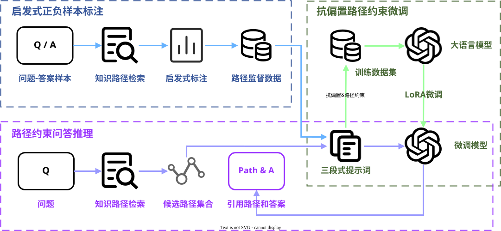

# 第四章 面向知识图谱问答的路径忠实指令微调方法

## 4.1 引言

近年来，在多跳知识图谱问答领域，将检索得到的知识路径提供给大语言模型作为上下文信息，已经成为提升模型推理性能的常用方法[2-4]。然而，从知识图谱中检索得到知识路径并不代表大语言模型能够依据路径进行准确、忠实的推理。大语言模型的内部推理过程并不透明，即便提供了相关路径，模型仍可能脱离检索上下文，依赖自身参数化知识作答，产生幻觉或无据的答案[18]，其输出的思维链解释也可能与最终答案并不一致[11]。归因问答（Attributed Question Answering）的提出进一步表明，问答系统不仅需要给出正确答案，还需要为答案提供可追溯的证据引用，而模型能否真正引用所提供的路径证据，仍是尚未解决的问题[10]。为了让大语言模型能够遵循知识路径进行忠实问答，有研究者将候选路径作为大语言模型的上下文，通过提示词工程引导模型输出思维链（Chain-of-Thought, CoT），以显式展开推理步骤[16]，但该方法更依赖模型本身的推理能力，往往只有更大参数量的大语言模型才能取得更好的效果。此外，大语言模型对上下文信息的利用存在位置敏感现象，位于中部的候选路径更容易被忽略，仅靠扩充上下文并不能保证路径被充分利用[7]。

另一方面，随着小参数量（小于 10B）大语言模型的语义理解与推理能力不断增强，有研究发现在特定任务上对其进行微调，能够取得与大参数量大语言模型接近甚至更优的效果[15]，而小参数量大语言模型本身在私有化部署、推理性能等方面也具备明显优势。与依赖提示词工程的少样本方法相比，微调能够使模型稳定适配领域数据的分布，并约束输出的格式与行为，避免长上下文场景下提示策略的脆弱性。因此，通过构建特定领域的训练数据集并微调大语言模型，成为越来越多研究者的重要选择。然而，微调效果高度依赖于训练数据的质量，而且数据构建成本成为该方法落地的关键瓶颈。

在知识图谱问答任务中，主流的微调数据构建方法主要分为两类。一类是面向工具调用的方法，构建问题与查询语句配对的训练语料，让模型理解问题语义并输出相应的查询语句，结合知识图谱工具查询结果[14,19]。另一类是面向规划的方法，构建问题与关系序列配对的训练语料，让模型掌握知识图谱的关系语义，根据问题解析多跳关系序列，并据此在知识图谱中提取对应三元组[15]。然而，这两类方法在数据构造、训练资源与推理忠实性等方面仍面临明显挑战。前者需要相关的查询语句数据集作为真值，但很多真实场景和问答数据集往往并没有相关语料，需要通过昂贵的人工标注或使用更先进的大语言模型作为教师模型来生成训练数据集，标注成本高且存在错误传播风险。此外，查询语句和关系序列都是知识图谱中的信息，并不存在于大语言模型的参数化知识中，通常需要全量参数微调才能让模型学习并记忆相关语义信息，带来较大的训练开销。

尽管上述方法在知识图谱问答领域证明了其有效性，但如何低成本地构建高质量训练数据集、如何在有限资源下完成训练并保持优秀的问答性能，仍是当前面临的挑战。针对上述问题，本章提出一种面向知识图谱问答的路径忠实指令微调方法。该方法利用第三章提出的基于模型推理得分引导的多样化路径检索方法（RSDPR）作为路径检索器来获取候选路径，首先利用启发式答案匹配策略自动标注路径真值，无需人工标注或教师模型即可完成数据构造；然后采用路径重排与干扰路径注入的抗偏置训练数据增强策略，提高模型对路径位置与噪声干扰的鲁棒性；最后利用参数高效微调方法完成模型训练，实现从数据构建到忠实问答推理的完整闭环。在WebQSP和CWQ数据集上的实验结果证明，本章方法能够低成本完成高质量数据集构建，在有限计算资源下实现大语言模型微调训练，并与先进方法相比在多项指标上具有竞争力。

## 4.2 路径忠实指令微调方法

为使大语言模型能够依据检索得到的候选路径进行忠实的问答推理，本节提出路径忠实指令微调方法。该方法通过启发式答案匹配规则自动标注路径真值并构造引用-答案联合的自监督目标，在指令微调过程中引入抗偏置训练策略，并使用参数高效微调方法完成模型训练，从而在无需人工标注和教师模型的条件下，实现从训练数据构建到忠实问答推理的完整流程。

### 4.2.1 方法整体框架

路径忠实指令微调方法的基本思路是利用检索得到的候选路径作为上下文信息来增强大语言模型在知识图谱问答任务中的推理能力。该方法在设计上遵循如下目标：以启发式答案匹配规则自动构建包含正负样本的高质量训练数据；通过抗偏置策略缓解模型对路径位置的依赖并提高对干扰路径的判别能力，从而提升推理的忠实性与鲁棒性；设计合理的指令数据格式与自监督目标，使模型在推理时显式依赖路径证据作答，避免幻觉输出；采用参数高效微调技术，在有限计算资源下完成训练并取得优秀的问答性能表现。



<p align="center">图4-1　路径忠实指令微调方法整体框架</p>

本章所提方法的整体框架如图 4-1 所示，由数据构建、抗偏置训练和问答推理三个阶段构成：

（1）启发式答案匹配标注
在数据构建阶段，针对每个样本，利用候选路径与标准答案集之间的匹配关系设计启发式匹配规则自动构建弱监督标签，将候选路径划分为支持路径和干扰路径，并针对不存在有效路径的情况构造拒答样本。该方法无需人工标注或教师模型，即可在大规模数据集上高效构建包含推理路径的训练数据。

（2）抗偏置路径约束微调
在训练阶段，对有序候选路径进行随机重排并注入一定比例的干扰路径，能够有效降低大语言模型对路径位置的依赖，并提高对干扰路径的判别能力。同时利用三段式指令微调范式约束模型推理规则、序列化输入知识路径，并显式约束输出路径引用和答案来学习可解释的忠实推理能力。在模型微调训练部分，本章采用量化低秩适应（QLoRA）这一参数高效微调方法，大幅降低计算与显存开销。

（3）路径约束问答推理
在推理阶段，将给定问题与检索得到的候选路径列表组织为上下文指令提示词，由微调后的模型直接生成引用编号与答案实体的联合输出；若模型判断当前候选路径无法支撑答案推导，则直接生成拒答标识。该方法使得模型输出不仅包含答案集合，还包含对应引用路径作为证据，使得模型的回答具备可追溯、可解释的特性。

### 4.2.2 基于启发式答案匹配的正负样本数据标注策略

为实现大模型在知识图谱上的可解释忠实推理，通常需要大量的“问题-推理路径-答案”数据。然而，现有的知识图谱问答数据集通常只包含“问题-答案”对，并不包含推理路径信息，缺少细粒度的中间推理路径标注。现有研究的方法主要是利用人工标注或使用教师模型生成推理路径，但前者成本高昂无法支持大量数据标注，后者则缺少对知识图谱数据源的认知，要么使用逐步检索推理[4]，但代价高昂且效率低下，要么使用关系序列匹配[2,3]，但容易引入大量无关路径。

本节提出一种基于启发式答案匹配的正负样本数据标注策略，该策略依赖路径检索得到的候选路径，通过分析候选路径与标准答案之间的匹配关系，自动标注路径真值，并引入引用-答案联合自监督信号，使模型在推理时显式依赖路径证据作答。相比人工标注或教师模型生成路径，该策略无需额外的人工成本或教师模型，能够在大规模数据集上高效构建训练数据。

在给定问题 $q$、标准答案集 $\mathcal{A}$ 以及候选路径集合 $\mathcal{P} = \{p_1, p_2, \dots, p_K\}$ 的情况下，提取每条路径 $p_i$ 的尾实体节点 $e_{tail}^{(i)}$，定义一个启发式匹配函数 $f(p_i, \mathcal{A})$，用于判断路径尾实体是否命中标准答案集：

$$
f(p_i, \mathcal{A}) =
\begin{cases}
1, & \text{if } e_{\text{tail}}^{(i)} \in \mathcal{A} \\
0, & \text{otherwise}
\end{cases}
\tag{4-1}
$$

当 $f(p_i, \mathcal{A}) = 1$ 时，路径 $p_i$ 被标注为**支持路径**（Support Path），路径集合记为 $\mathcal{P}^+$；当 $f(p_i, \mathcal{A}) = 0$ 时，路径 $p_i$ 被标注为**干扰路径**（Distractor Path），路径集合记为 $\mathcal{P}^-$。通过这种后验启发式匹配策略，能够在无需人工标注的情况下，为每个问题自动生成正负样本路径标注，从而构建大规模的训练数据集。

在实际应用中，模型不可避免地会面临真实路径缺失的场景，即检索得到的候选路径集合中没有任何路径命中标准答案。如果仅使用有效回答的样本进行训练，在面对缺少有效路径的问题时，模型可能会强制选择相似干扰路径作为推理依据进行作答，进而引发严重的参数化知识幻觉问题。为处理这种情况，本策略引入显式拒答样本（Unanswerable Sample）的构造方法，即当所有候选路径均未命中答案时，将该问题标注为拒答样本，在后续训练过程中，如果模型判断当前检索的候选路径中没有有效的路径证据，则直接生成拒答标识。通过主动拒答机制，模型能够在推理过程中避免盲目生成答案，从而提升问答系统的可信度。

### 4.2.3 基于路径重排与干扰路径注入的抗偏置训练策略

在传统的知识图谱检索增强范式中，候选路径通常严格按照检索相关性得分降序排列。然而，现有研究表明，大语言模型在处理长序列时存在严重的位置偏置（Positional Bias）问题，模型的注意力会更倾向于关注输入序列的前部信息。如果直接将检索得到的候选路径按原始顺序输入模型进行监督微调，模型可能会陷入捷径学习（Shortcut Learning），在训练过程中通过学习到“高质量路径往往位于序列前端”这一错误的推理模式，而非真正理解路径内容的语义与拓扑关系来进行推理。

为了打破这种位置依赖，迫使模型深入理解路径内容本身的语义关联性，本节在构建微调训练样本时引入双重抗偏置策略：一方面对候选路径进行随机置换，并同步更新自监督目标中的引用编号 $[c]$，消除路径输入顺序带来的位置偏置；另一方面在真值路径中注入一定比例的干扰路径，使得模型在训练过程中学会判断路径的有效性，提升模型对干扰路径的判别能力。

具体而言，对于训练样本 $(q, \mathcal{P}^+, \mathcal{A})$，首先在路径集合中注入一定比例的干扰路径 $\mathcal{P}^-$，形成混合路径集合 $\mathcal{P}^+ \cup \mathcal{P}^-$。然后引入一个均匀分布的随机置换函数 $\pi$，对合并后的路径集合进行随机置换，得到新的路径顺序 $\mathcal{P}^{'}$，即：

$$
\mathcal{P}^{'} = \pi(\mathcal{P}^+ \cup \mathcal{P}^-)
\tag{4-2}
$$

最后，按照重排后的路径顺序，为每条路径重新分配引用编号 $[c]$，并将其与问题 $q$ 和标准答案 $\mathcal{A}$ 一起构建微调训练样本。通过这种方式，支持路径在输入提示词中的绝对位置变为均匀分布，模型在训练时无法再依赖位置信息来最小化损失函数，而是必须将其注意力集中在自然语言问题与路径内容的语义推理上。

### 4.2.4 指令数据格式化与模型训练

本节介绍指令数据格式化方案、训练目标设计与参数高效微调流程。

**指令数据格式化** 将每个训练样本构造为标准的三段式指令，包含系统提示词（System）、用户消息（User）和模型输出（Assistant）三部分。其中系统提示词明确模型角色与任务规则：模型只能从候选路径中提取尾实体作为答案，不得生成或虚构路径之外的实体，并规定先输出路径引用编号，再输出答案实体，约束模型在推理时显式依赖路径证据作答：

```
You are a KGQA assistant. Given reasoning paths from a knowledge graph and a question, identify which paths support the answer, then extract the answer from the tail entities of those supporting paths.
Rules:
- Only output entity names that appear in the provided paths.
- Do not generate or fabricate new entity names.
Output format:
Supporting Paths: <path numbers>
Answer: <entity_name> | <entity_name>
```

用户消息由问题与通过第4.2.2和第4.2.3节策略处理增强后的候选路径列表组成。其中知识路径采用连续链式格式（Chain Format）序列化，即将多跳三元组展开为 $e_0 \to r_1 \to e_1 \to r_2 \to e_2$ 的形式，保留实体与关系的完整连接结构，便于模型理解路径的语义拓扑：

```
Question: {q}

Reasoning Paths:
1: {e_0} -> {r_1} -> {e_1} -> {r_2} -> {e_2}
2: ...
```

模型输出的监督目标采用引用-答案联合格式，并与系统提示词相配合，要求模型在给出答案的同时，显式输出所依据的支持路径编号：

```
Supporting Paths: <path numbers>
Answer: <entity_name> | <entity_name>
```

对于拒答样本，监督目标则设置为拒答形式：

```
Supporting Paths: None
Answer: None
```

**损失函数** 在模型指令微调过程中，模型需要学习的是如何针对特定任务生成高质量的回答，并遵循指令输出固定格式，因此，本方法仅对模型输出部分（即 Assistant 回复）计算交叉熵损失，而对系统提示词和用户消息部分的标签全部标记掩码来忽略输入部分的梯度传播。记完整的指令输入（System + User）为 $\mathcal{X}$，对于每个训练样本 $(q, \mathcal{C}, \mathcal{Y}_{\text{target}})$，损失函数定义为：
$$
\mathcal{L} = -\sum_{y_t \in \mathcal{Y}_{\text{target}}} \log P_{\theta}(y_t \mid \mathcal{X}, y_{<t})
\tag{4-3}
$$

其中 $\mathcal{Y}_{\text{target}}$ 为模型输出的联合自监督目标序列，包含路径引用编号与答案实体，$y_t$ 为目标序列中的第 $t$ 个 token，$P_{\theta}(y_t \mid \mathcal{X}, y_{<t})$ 为模型在给定完整指令输入 $\mathcal{X}$ 和前 $t-1$ 个 token 的条件下预测第 $t$ 个 token 的概率。

**参数高效微调** 在训练阶段，本方法采用量化低秩适应（QLoRA）技术对基座大语言模型进行微调。该方法通过冻结基座模型庞大的主干参数，仅在特定网络层注入可训练的低秩旁路矩阵，从而大幅降低微调训练所需的计算与显存开销。具体而言，本方法以 LLaMA 3.1 8B Instruct 为基座模型，采用 4-bit NF4 格式进行量化加载，将 LoRA 适配器注入模型自注意力层（q_proj, k_proj, v_proj, o_proj）与前馈神经网络投影层（gate_proj, up_proj, down_proj）。在超参数设定上，将秩（rank）设置为16，缩放系数（alpha）设置为32，dropout 设置为0.0，此外结合 Unsloth 框架的梯度检查点（gradient checkpointing）技术进一步优化显存占用。通过上述参数高效微调策略，本方法在有限的计算资源下完成模型训练，并在知识图谱问答任务中取得了优异的性能表现。

## 4.3 实验结果及分析

### 4.3.1 实验设置

**实验模型** 本章主要使用 LLaMA 3.1 8B Instruct 作为基座模型进行微调实验，并采用 LLaMA 3.2 1B Instruct、LLaMA 3.2 3B Instruct、Qwen3.5-0.8B、Qwen3.5-2B、Qwen3.5-4B 和 Mistral 7B Instruct 等小参数量模型进行对比实验，验证本章方法在不同模型上的适用性。所有实验均在 RTX 4060Ti 16GB GPU 上进行。

**数据集** 本章在WebQSP和CWQ数据集上开展实验。两个数据集均使用第三章提出的RSDPR检索方法获取候选路径，其中检索候选路径数量均设置为$K=20$，$\lambda=0.2$、$\eta=1.0$。分析检索结果发现，WebQSP和CWQ测试集的PathHit@20分别为94.43%和73.61%，前者检索结果中基本包含真实答案路径，而后者则存在较多缺失真实答案路径的情况。为验证模型在不同候选路径质量下的问答性能，本章在WebQSP数据集上进行主要实验，并在CWQ数据集上验证模型在候选路径中不存在正确答案时的拒答能力。

**评价指标** 本章从问答性能、路径引用质量和输出可靠性三个方面评价模型。问答性能采用Hit、Hit@1、Macro-P、Macro-R、Macro-F1和完全匹配率（Exact Match，EM）：Hit表示预测答案集合至少包含一个真实答案，Hit@1表示首个预测答案正确，宏平均指标在单问题计算精确率、召回率和F1后对测试集取平均，EM表示预测答案集合与真实答案集合完全一致。

路径引用质量采用引用精确率（Citation Precision，Cite-P）和引用召回率（Citation Recall，Cite-R）衡量。设测试集包含 $N$ 个问题，第 $i$ 个问题的模型引用路径编号集合为 $C_i$，依据第4.2.2节启发式匹配规则标注的支持路径编号集合为 $G_i$，则

$$
\operatorname{Cite-P}=\frac{1}{N}\sum_{i=1}^{N}\frac{|C_i\cap G_i|}{|C_i|},\qquad
\operatorname{Cite-R}=\frac{1}{N}\sum_{i=1}^{N}\frac{|C_i\cap G_i|}{|G_i|}.
\tag{4-4}
$$

为了衡量模型在推理过程中是否忠实依赖候选路径，本章进一步提出路径外实体率（Out-of-Path Entity Rate，OPER）指标，衡量模型在生成答案时是否引用了候选路径之外的实体。记候选路径中的实体集合为 $E_i$，预测答案集合为 $A_i^{*}$，则 $A_i^{*} \not\subseteq E_i$ 则表示模型在预测答案时引用了候选路径之外的实体：

$$
\operatorname{OPER}=\frac{1}{N}\sum_{i=1}^{N}
\frac{|A_i^{*} \setminus E_i|}{|A_i^{*}|}.
\tag{4-5}
$$

最后，本章将候选路径中不包含任何真实答案的问题视为不可回答样本。记正确拒答、错误拒答和遗漏拒答的样本数分别为 $N_{\mathrm{CR}}$、$N_{\mathrm{FR}}$ 和 $N_{\mathrm{MR}}$，则拒答精确率、拒答召回率和拒答F1分别为：

$$
P_{\mathrm{rej}}=\frac{N_{\mathrm{CR}}}{N_{\mathrm{CR}}+N_{\mathrm{FR}}},\qquad
R_{\mathrm{rej}}=\frac{N_{\mathrm{CR}}}{N_{\mathrm{CR}}+N_{\mathrm{MR}}},\qquad
F1_{\mathrm{rej}}=\frac{2P_{\mathrm{rej}}R_{\mathrm{rej}}}{P_{\mathrm{rej}}+R_{\mathrm{rej}}}.
\tag{4-6}
$$

其中，错误拒答表示候选路径包含真实答案但模型选择拒答，遗漏拒答表示候选路径不包含真实答案但模型仍然作答。

### 4.3.2 主要实验结果与分析

本节首先在 WebQSP 数据集上对比分析本章提出的 PFIT 微调方法在基座模型上的各项评价指标，验证大语言模型微调后对知识路径的利用能力，具体如表 4-1 所示。

<p align="center">表4-1　PFIT指令微调结果对比（%）</p>

| 方法                  |     Hit@1 |       Hit |  Macro-F1 |        EM | 引用精确率 | 引用召回率 | 路径外实体率 |
| :-------------------- | --------: | --------: | --------: | --------: | ---------: | ---------: | -----------: |
| 仅基座模型            |     25.05 |     48.89 |     17.02 |      1.39 |          — |          — |            — |
| 仅微调模型            |     26.25 |     43.77 |     20.48 |      9.11 |          — |          — |            — |
| 基座模型+候选路径     |     82.23 |     90.01 |     64.07 |     33.08 |      64.25 |      69.27 |         0.86 |
| **微调模型+候选路径** | **86.21** | **90.77** | **79.60** | **64.77** |  **84.08** |  **88.66** |     **0.00** |

**微调前后推理性能对比** 从表 4-1 的性能指标可以发现，本章提出的PFIT指令微调方法能够有效提升大语言模型利用知识路径的能力。与基座模型结合候选路径的结果相比，微调模型结合相同候选路径后，Hit@1、Macro-F1和EM分别提升了3.98、15.53和31.69个百分点，显著提高了模型对候选路径中有效支持路径的辨别能力。此外，对比仅微调模型和仅基座模型的结果，可以发现，微调后的模型在没有候选路径的情况下性能并未显著提升，这是由于PFIT微调方法本身并未使模型记忆更多的参数化知识，而是学会如何更好地利用候选路径，因此在没有外部路径信息的情况下，模型的性能提升有限。

**推理可解释性** 除了微调模型本身的性能提升，本章方法也注重模型本身的可解释性，即模型推理能否在正确回答问题的同时给出其推理路径证据。从表 4-1可以看出，与基座模型结合候选路径的结果相比，微调模型的路径引用精确率和召回率分别提升了19.83和19.39个百分点（达到84.08%和88.66%），说明模型能够更加准确地选择与问题相关的支持路径。此外，基座模型在输出答案时给出0.86%的与候选路径无关的实体作为答案，这说明模型没有忠实遵循候选路径进行推理，输出仍存在一定的幻觉；PFIT微调后模型输出的路径外实体率为0.00%，说明模型输出的所有答案实体均能在输入候选路径中找到对应依据，未出现超出路径上下文覆盖范围的实体输出，能够忠实依据候选路径进行回答。

为验证 PFIT 对不同参数规模和模型架构的适用性，本节进一步选取 LLaMA 3.2、Qwen3.5 和 Mistral 系列模型比较在 WebQSP 数据集上微调前后的性能，结果如表 4-2 所示。

<p align="center">表4-2　不同基座模型经PFIT微调前后的性能对比（%）</p>

| 模型                   | 设置           |     Hit@1 |       Hit |  Macro-F1 |        EM | 引用精确率 | 引用召回率 |
| :--------------------- | :------------- | --------: | --------: | --------: | --------: | ---------: | ---------: |
| LLaMA 3.2 1B Instruct  | 微调前         |     40.92 |     53.83 |     30.55 |      8.22 |      41.86 |      81.03 |
|                        | **PFIT微调后** | **79.00** | **86.40** | **66.52** | **42.44** |  **65.42** |  **83.42** |
| LLaMA 3.2 3B Instruct  | 微调前         |     73.94 |     88.05 |     55.80 |     18.72 |      51.05 |      71.14 |
|                        | **PFIT微调后** | **84.00** | **89.12** | **76.35** | **59.58** |  **80.78** |  **86.66** |
| Qwen3.5-0.8B（非思考） | 微调前         |     56.36 |     71.54 |     42.54 |     12.78 |      37.43 |  **89.28** |
|                        | **PFIT微调后** | **80.71** | **88.24** | **74.14** | **56.23** |  **77.77** |      85.90 |
| Qwen3.5-2B（非思考）   | 微调前         |     75.40 |     82.42 |     62.57 |     37.13 |      50.76 |      76.92 |
|                        | **PFIT微调后** | **83.30** | **88.87** | **76.36** | **60.28** |  **81.31** |  **86.59** |
| Qwen3.5-4B（非思考）   | 微调前         |     80.96 |     87.22 |     69.83 |     48.07 |      64.97 |      78.87 |
|                        | **PFIT微调后** | **86.53** | **89.50** | **79.28** | **65.84** |  **85.12** |  **86.89** |
| Mistral 7B Instruct    | 微调前         |     77.42 |     83.93 |     54.31 |     17.65 |      57.80 |      60.85 |
|                        | **PFIT微调后** | **86.40** | **90.83** | **79.65** | **64.64** |  **84.27** |  **88.64** |

**跨模型适用性** 表 4-2 显示，PFIT 在六种不同规模和架构的小参数量大语言模型上均取得了显著的性能提升，说明本节提出的方法具有良好的跨模型适用性。其中 EM 指标提升最为突出，在 Mistral 7B Instruct 上甚至提升了 46.99 个百分点，这表明 PFIT 方法有效的增强了模型输出确定性正确答案的能力。PFIT 微调对更小参数量的模型提升更为明显，Qwen3.5-0.8B 微调后 Hit@1 和 Macro-F1 分别提升了 24.35 和 31.60 个百分点，甚至在各项指标均超过了微调前参数量更大的 Qwen3.5-4B 模型。

本节进一步在检索质量较差的CWQ数据集上验证模型在候选路径中不存在正确答案时的拒答能力，结果如表4-3所示。

<p align="center">表4-3　CWQ下的拒答能力表现（%）</p>

| 方法                   |     Hit@1 |       Hit |  Macro-F1 |        EM | 拒答精确率 | 拒答召回率 |    拒答F1 |
| :--------------------- | --------: | --------: | --------: | --------: | ---------: | ---------: | --------: |
| 基座模型               |     48.29 |     60.10 |     42.67 |     20.87 |          - |          - |         - |
| **PFIT（无拒答监督）** | **59.13** | **62.31** | **57.21** | **50.92** |          - |          - |         - |
| PFIT（含拒答监督）     |     59.08 |     61.85 |     56.80 |     50.47 |  **97.11** |  **72.00** | **82.69** |

**拒答能力** 表4-3显示，在未加入拒答监督时，基座模型和PFIT微调模型在CWQ数据集上，面对不包含有效支持路径的样本会强行引用至少一条路径进行作答，不具备主动拒答的能力。相比之下，加入拒答样本监督后，PFIT微调模型能够在缺少有效路径证据的情况下识别不可回答问题并进行拒答，其拒答精确率、拒答召回率和拒答F1分别达到97.11%、72.00%和82.69%，通过主动拒答机制，模型能够在检索质量不高的情况下避免盲目生成答案，从而提升问答系统的可信度。但同时也注意到，PFIT在CWQ数据集上的Hit@1和Macro-F1略有下降，通过分析发现是由于拒答能力的引入使得模型在一些模糊场景下选择拒答而非作答，导致少量可回答问题被误判为不可回答，但由于高可信度的拒答能力，模型在利用候选路径进行回答时的可靠性得到了显著提升。

### 4.3.3 消融实验结果与分析

本节在 WebQSP 数据集上针对关键设计和策略进一步展开消融分析。

**输出格式消融** 通过设计不同的输出监督形式，考察模型在不同输出格式下的问答性能、证据可解释性和推理效率。结果如表4-4所示，其中“仅答案”表示模型仅输出答案实体，“引用+答案”表示模型输出路径引用编号与答案实体的联合格式，“引用+答案（JSON格式）”表示模型输出路径引用编号与答案实体的联合JSON格式，“显式思维链”表示模型在引用与答案之外输出1至2句简短的显式推理说明。

<p align="center">表4-4　不同输出监督形式的对比结果（%）</p>

| 输出格式              |     Hit@1 |       Hit |  Macro-F1 |        EM | 引用精确率 | 路径外实体率 | 格式合规率 | 平均单样本推理耗时（秒/条） |
| :-------------------- | --------: | --------: | --------: | --------: | ---------: | -----------: | ---------: | --------------------------: |
| 仅答案                | **86.97** | **91.02** | **81.11** | **68.06** |          — |         1.33 |     100.00 |                    **2.19** |
| **引用+答案**         |     86.21 |     90.77 |     79.60 |     64.77 |  **84.08** |     **0.00** | **100.00** |                        4.42 |
| 引用+答案（JSON格式） |     86.08 |     89.37 |     78.69 |     63.57 |      83.27 |         0.06 |      99.05 |                        6.44 |
| 显式思维链            |     85.58 |     90.07 |     77.97 |     61.42 |      82.27 |         0.06 |     100.00 |                        7.95 |

可以发现，仅要求模型生成答案虽然在Hit@1和Macro-F1等问答指标中取得领先，但路径外实体率达到1.33%，且无法提供可解释的路径引用。JSON格式的引用-答案联合输出虽然问答指标上接近纯文本格式，但特定格式增加了生成约束，在格式遵从性上有所下降。显式思维链并未带来问答性能提升，反而因输出内容增加而延长了平均单样本推理耗时。相比之下，引用-答案联合输出在保持较好问答性能的同时，将路径外实体率降至0.00%，并提供可追溯的路径引用，在问答性能、证据可核验性和推理效率之间取得了较好的平衡。

**路径重排策略消融** 通过消融训练阶段和推理阶段的路径重排策略，来分析模型对候选路径顺序的依赖程度，结果如表4-5所示。

<p align="center">表4-5　路径重排策略消融实验结果（%）</p>

| 训练阶段路径重排 | 推理阶段路径重排 |     Hit@1 |       Hit |  Macro-F1 |        EM | 引用精确率 | 路径外实体率 |
| :--------------: | :--------------: | --------: | --------: | --------: | --------: | ---------: | -----------: |
|        ×         |        ×         |     75.59 |     87.22 |     70.23 |     49.15 |      72.10 |         0.05 |
|        ×         |        ✓         |     36.56 |     74.57 |     38.53 |      9.68 |      38.24 |         0.11 |
|      **✓**       |      **×**       | **86.21** | **90.77** | **79.60** | **64.77** |  **84.08** |     **0.00** |
|        ✓         |        ✓         |     83.43 |     89.69 |     79.21 |     63.76 |      83.79 |         0.00 |

在训练阶段保持原始路径顺序进行训练的模型，如果推理阶段保持候选路径原始顺序，能取得75.59%的Hit@1和70.23%的Macro-F1，一旦推理阶段路径顺序改变，Hit@1和Macro-F1便分别下降39.03和31.70个百分点，这说明模型在训练阶段明显依赖路径位置形成捷径学习，而非真正根据路径内容进行判断。采用路径重排策略训练后，推理阶段的候选路径保持原始顺序时，Hit@1和Macro-F1分别提升至86.21%和79.60%，而在推理阶段置换路径顺序后，Hit@1和Macro-F1仅下降2.78和0.39个百分点，说明路径重排策略有效缓解了模型对路径位置的依赖，使模型能够学会依据问题与路径内容之间的语义关系进行推理。

**干扰路径增强策略消融** 路径重排解决的是候选路径的顺序偏置问题，在训练数据中注入一定比例的干扰路径则用于提升模型辨别支持路径与干扰路径的能力。实验设置30%、50%和100%三种目标干扰路径比例，以验证模型面对噪声上下文时的鲁棒性，结果如表4-6所示。

<p align="center">表4-6　干扰路径训练与推理期噪声注入实验结果（%）</p>

| 训练阶段干扰路径比例 | 推理阶段合成干扰路径数 |     Hit@1 |       Hit |  Macro-F1 |        EM | 引用精确率 | 路径外实体率 |
| :------------------- | :--------------------: | --------: | --------: | --------: | --------: | ---------: | -----------: |
| 30%                  |           0            |     75.40 |     88.43 |     56.25 |     25.17 |      51.40 |         0.02 |
| 50%                  |           0            |     77.55 |     87.79 |     65.13 |     40.48 |      63.17 |         0.03 |
| **100%**             |         **0**          | **86.21** | **90.77** | **79.60** | **64.77** |  **84.08** |     **0.00** |

随着训练阶段干扰路径比例由30%提高至100%，Macro-F1、EM和引用精确率总体明显提升，说明干扰路径能够促使模型学习区分支持证据与干扰路径。结果表明，将干扰路径作为负样本参与训练，有助于提高模型面对低质量检索上下文时的鲁棒性。

**引用路径干预验证** 为验证模型生成答案是否真正依赖其引用的路径证据，本节采用反事实路径干预方法。以主实验首次推理结果为基准，在第二次推理中分别删除等量未引用路径、仅保留被引用路径以及删除全部被引用路径，并计算干预前后答案集合与引用路径集合的Jaccard相似度，结果如表4-7所示。

<p align="center">表4-7　引用路径干预前后的平均Jaccard相似度（%）</p>

| 路径干预方式       | 答案集合平均Jaccard相似度 | 引用路径集合平均Jaccard相似度 |
| :----------------- | ------------------------: | ----------------------------: |
| **全部保留**       |                    100.00 |                        100.00 |
| 删除等量未引用路径 |                     97.60 |                         97.77 |
| 仅保留被引用路径   |                     98.49 |                         98.69 |
| 删除全部被引用路径 |                      2.91 |                          0.00 |

由表4-7可知，删除等量未引用路径后，答案集合与引用路径集合的平均Jaccard相似度仍分别达到97.60%和97.77%；仅保留被引用路径时，两项相似度进一步达到98.49%和98.69%。这表明未引用路径的移除不会实质性改变模型选择的路径和答案，模型生成结果主要由其引用路径决定。相反，删除全部被引用路径后，答案集合的平均Jaccard相似度降至2.91%，原有答案几乎全部发生改变，该显著反差表明，模型生成结果的改变源于模型所依赖证据的缺失。因此，模型给出的路径引用并非附加在答案之后的形式化输出，而是与答案生成过程具有直接关联，从反事实层面验证了PFIT模型基于引用路径进行忠实问答的能力。

## 4.4 本章小结

---

**本章新增参考文献（编号沿用全文全局表，全文整合时并入）：**

[7] Liu N F, Lin K, Hewitt J, et al. Lost in the Middle: How Language Models Use Long Contexts. Transactions of the ACL, 2024.

[10] Bohnet B, Tran V Q, Verga P, et al. Attributed Question Answering: Evaluation and Modeling for Attributed Large Language Models. arXiv preprint arXiv:2212.08037, 2022.

[11] Turpin M, Michael J, Perez E, et al. Language Models Don't Always Say What They Think: Unfaithful Explanations in Chain-of-Thought Reasoning. NeurIPS, 2023.

[14] Li T, Ma X, Zhuang A, et al. KB-BINDER: Binding Language Models in Symbolic Languages for Knowledge Base Question Answering. ACL, 2023.

[15] Li X, He S, Lei F, et al. Teaching Small Language Models to Reason for Knowledge-Intensive Multi-Hop Question Answering. Findings of ACL, 2024.

[16] Lyu Q, Havaldar S, Stein A, et al. Faithful Chain-of-Thought Inference. EMNLP, 2023.

[18] Ji Z, Lee N, Frieske R, et al. Survey of Hallucination in Natural Language Generation. ACM Computing Surveys, 55(12), 2023.

[19] Zhang J. Graph-ToolFormer: To Empower LLMs with Graph Reasoning Ability via Prompt Augmented by ChatGPT. arXiv preprint arXiv:2304.11116, 2023.
