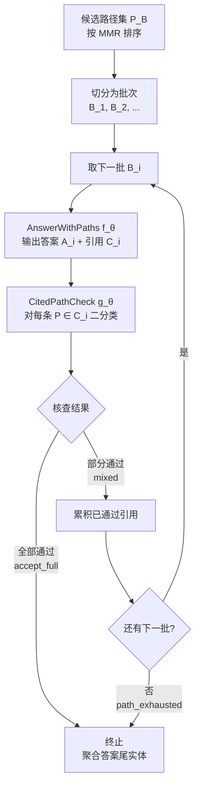

# 决策层 Agent 流程图

```mermaid
flowchart TD
  A[候选路径集 P_B<br/>按 MMR 排序] --> B[切分为批次<br/>B_1, B_2, ...]
  B --> C[取下一批 B_i]
  C --> D[AnswerWithPaths f_θ<br/>输出答案 A_i + 引用 C_i]
  D --> E[CitedPathCheck g_θ<br/>对每条 P ∈ C_i 二分类]
  E --> F{核查结果}
  F -- 全部通过<br/>accept_full --> G[终止<br/>聚合答案尾实体]
  F -- 部分通过<br/>mixed --> H[累积已通过引用]
  H --> I{还有下一批?}
  I -- 是 --> C
  I -- 否<br/>path_exhausted --> G
```
